# Programmare in Python

Viene ora introdotto _Python_ come linguaggio di programmazione.
Vedremo su quali ambienti web è possibile programmare in _Python_,
e semplici regole per convertire programmi _FlowRun_ in _Python_.

1. TOC
{: toc }

## Introduzione

_Python_ è uno fra i più diffusi linguaggi di programmazione, se non il più diffuso.
È un linguaggio facile da imparare ed è utilizzabile in moltissimi campi: applicazioni
per computer e smartphone, analisi dati, **intelligenza artificiale**, siti web,
dispositivi connessi a internet, …

La probabilità di incontrare _Python_ in un posto di lavoro è molto alta,
anche in caso di lavori non direttamente legati all'informatica.

Cercare su YouTube "introduzione a Python".

## Installazione e primo utilizzo

_Python_ può essere installato in vari modi, in funzione del tipo di computer e sistema operativo.
Per maggiori informazioni, consultare il sito ufficiale [python.it](https://www.python.it).
In questo corso **non** installeremo _Python_ sul computer, ma utilizzeremo dei servizi
online semplificati per scrivere codice anche da iPad senza doversi preoccupare di niente.

Gli ambienti che useremo sono:

- [FARE](https://fare.polito.it/python), ambiente del Politecnico di Torino.
- [Online GDB](https://www.onlinegdb.com), ricordandoci di selezionare _Python 3_ da menù in alto a destra.

Consiglio di usare il secondo, anche se il primo è più semplice e va bene solo per lavoretti elementari.

Se invece si vuole provarlo sul proprio computer, iniziare con installare e capire
[Visual Studio Code](https://code.visualstudio.com/) e installare la sua estensione per _Python_.

## Scrivere codice Python partendo da FlowRun

Vediamo ora come convertire i blocchi _FlowRun_ in istruzioni _Python_. Un algoritmo in
_FlowRun_ può essere riscritto in _Python_ semplicemente traducendo blocco per blocco.

### Declare

Il blocco _Declare_ non è necessario in _Python_ e deve essere omesso.

### Input (lettura) e Output (scrittura)

I blocchi _Input_ e _Output_ chiedono all’utente (lettura) o comunicano all’utente
(scrittura) il valore di una variabile. In _Python_, la lettura è effettuata
dall'istruzione `input`, che legge una stringa. Se ci si aspetta un intero,
un numero con la virgola o un booleano, la stringa deve essere convertita
manualmente tramite le funzioni `int`, `float` o tecniche per capire
se l'utente ha inserito _sì_ oppure _no_. Vedremo questo fra poco.

La funzione `input` può essere scritta senza parametri oppure con un messaggio
che viene proposto all'utente.

```python
a = input()                  # Non pone nessuna domanda, legge la risposta
b = input("Come ti chiami?") # Pone una domanda all'utente e legge la risposta
```

Le parentesi aperte e chiuse per le funzioni sono sempre necessarie, anche quando al loro interno
non c'è niente da aggiungere, come nel primo caso per l'istruzione `input`.

#### Leggere una variabile di tipo stringa

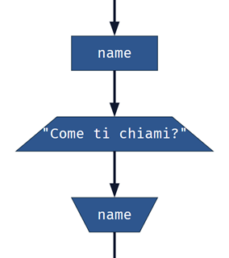

dove `name` è dichiarata come variabile di tipo stringa.

Equivale in _Python_ a:

```python
name = input("Come ti chiami?")
```

`input` restituisce sempre una stringa quindi non è necessario fare altro.

#### Leggere una variabile di tipo intero

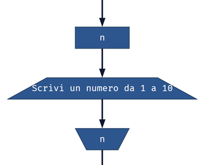

dove `n` è dichiarata come variabile di tipo intero.

Equivale in _Python_ a:

```python
n = int(input("Scrivi un numero da 1 a 10"))
```

`input` restituisce sempre una stringa quindi dobbiamo convertirla a intero.

L'istruzione `int` richiede parentesi aperte e chiuse con al loro interno cosa convertire
a intero, cioè `input(…)` compreso delle sue parentesi. Così facendo si converte
in intero quello che `input` ha letto.

#### Leggere una variabile di tipo reale (numero decimale)


dove `euro` è dichiarata come variabile di tipo numero reale.

equivale in _Python_ a:

```python
euro = float(input("Quanti soldi hai nel portafoglio?"))
```

L'istruzione `int` è sostituita da `float` in caso di numeri reali, cioè numeri con la virgola.
La virgola dovrà però essere sostituita dal punto (`3.14` invece che `3,14`) quando questa
viene digitata, in quanto _Python_ segue il sistema anglosassone in cui si usa il punto.

#### Leggere una variabile di tipo booleano (sì/no, vero/falso)

La conversione in booleano di quello che l'utente scrive è più complessa,
bisogna fondamentalmente capire se l'utente ha scritto _sì_, oppure un qualunque
altro testo che decidiamo abbia valore `True`.

Ad esempio:

```python
confirm = input("Sei sicuro di voler cancellare tutto? (S/N)") == "S"
```

In questo esempio controlliamo se quello che scrive l'utente è uguale (`==`) alla lettera `S` maiuscola.
Questa è un'[espressione booleana](#espressioni-booleane) spiegata poi meglio.

Noi nel testo della domanda gli suggeriamo di rispondere `S` o `N` in maiuscolo,
ma se l'utente risponde `s` in minuscolo? In questo caso viene interpretato come un _no_.

Per migliorare la situazione, possiamo controllare se l'utente risponde con una
o più risposte che noi consideriamo _sì_. Elenchiamo le risposte in una [lista](#liste-e-controllo-elementi-di-una-lista)
di risposte affermative e controlliamo se la risposta dell'utente è presente in questa lista.

```python
confirm = input("Sei sicuro di voler cancellare tutto?") in ["S", "s", "Sì", "sì", "Si", "si"]
```

In questo modo controlliamo maiuscole e minuscole, con o senza accento.
Se l'utente risponde con una delle risposte valide, la variabile `confirm` avrà
valore `True`, altrimenti avrà valore `False`.

Se abbiamo tante variabili booleane da leggere, possiamo evitare di ripetere la lista
assegnando lei stessa a una variabile:

```python
lista_si = ["S", "s", "Sì", "sì", "Si", "si"]

piove = input("Sta piovendo?") in lista_si
ho_ombrello = input("Hai l'ombrello?") in lista_si
macchina = input("Sei in macchina?") in lista_si
```

Una lista è un valore come altri e quindi può essere assegnato a una variabile e riusato.

#### Scrivere una variabile intera, stringa o reale
 
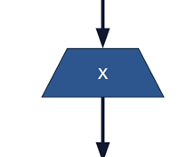

equivale in _Python_ a:

```python
print(x)
```

`x` può essere una variabile di qualsiasi tipo, intero, reale, stringa o altro.
Anche in questo caso le parentesi dell'istruzione `print` indicano al loro interno
cosa deve essere stampato e sono necessarie.

#### Scrivere una variabile booleana

Se `x` è una variabile o espressione booleana, verrà stampato `True` o `False`.
Se si vuole stampare `Sì` o `No`, `Vero` o `Falso` o altri testi, è necessario scriverlo così:

```python
print("Sì" if x else "No")
print("Yes" if x else "No")
print("Ja" if x else "Nein")
print("Vero" if x else "Falso")

print("Pari" if pari else "Dispari")

print("Testa" if testa else "Croce")
```

Questo `if` speciale non va confuso con l'`if` delle strutture [condizionali](#if).
È un altro tipo di `if`, si può usare solo nelle espressioni e funziona diversamente.
Può essere usato anche nelle condizioni, nelle assegnazioni, ovunque ci sono dei valori.

```python
for i in range(1, 10 if x else 20):
  ...
```

L'esempio processa i numeri da 1 a 10 (escluso) se il valore di
`x` è `True`, altrimenti i numeri da 1 a 20 (escluso).
`for` e `range` sono spiegati [più avanti](#for).

#### Scrivere un'espressione

L'istruzione `print` accetta all'interno delle parentesi espressioni anche più complesse,
come [espressioni matematiche](#espressioni-matematiche).

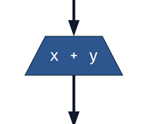

equivale in _Python_ a:

```python
print(x + y)
```

#### Scrivere un messaggio composto

Immaginiamo di avere una vincita di 50 € a un gioco memorizzata nella variabile `vincita`.
Vogliamo scrivere il messaggio _Hai vinto 50 euro_, usando la variabile `vincita`.

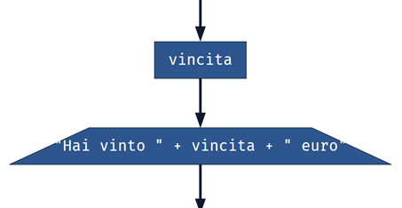

equivale in _Python_ a:

```python
print("Hai vinto", vincita, "euro")
```

Le virgole separano i 3 testi, variabili o espressioni da stampare,
il tutto all'interno delle parentesi della funzione `print`.
È possibile stampare 2, 3, 4 o più parametri che devono essere tutti separati da virgole.
Nel testo finale, tutti i parametri vengono separati da spazi
in modo da formare un testo elegante, senza testi appiccicato l'uno con l'altro.

### Assign

L’_Assign_ imposta una variabile a un determinato valore, cioè assegna
quel valore alla variabile. Se la variabile non esiste, viene dichiarata all'istante:
per questo non è necessario in _Python_ dichiarare le variabili e per questo il blocco
_Declare_ di _FlowRun_ non ha un corrispettivo in _Python_.

Le assegnazioni sono scritte direttamente in _Python_ e il loro codice corrisponde
a quello nei diagrammi a blocchi, senza dover usare nessuna istruzione particolare.

Le assegnazioni utilizzano **sempre** l'uguale singolo `=`.

#### Assegnare una costante intera o reale

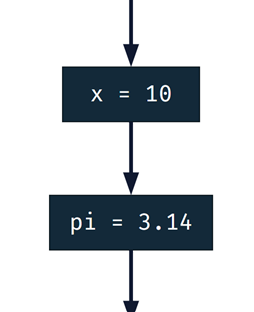

equivale in _Python_ a:

```python
x = 10
pi = 3.14 # pi-greco
```

#### Assegnare una costante stringa

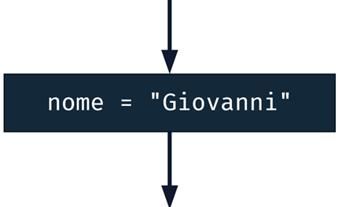

equivale in _Python_ a:

```python
nome = "Giovanni"
```

#### Assegnare una costante booleana

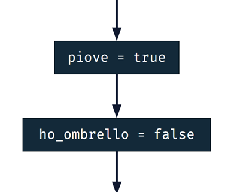

equivale in _Python_ a:

```python
piove = True
ho_ombrello = False
```

#### Assegnare il valore calcolato da un'espressione

Assumendo le variabili `x` e `y` già definite e contenenti dei numeri (interi o reali):

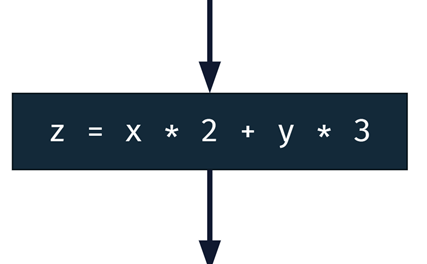

equivale in _Python_ a:

```python
z = x * 2 + y * 3
```

Come per `print`, è possibile comporre direttamente [espressioni matematiche](#espressioni-matematiche)
o [espressioni booleane](#espressioni-booleane) e assegnare il risultato a una variabile.

```python
mi_bagno = piove and not ho_ombrello
ho_freddo = mi_bagno and temperatura <= 15

if mi_bagno:
  print("Oh no, tornerò a casa fradicio!")

if ho_freddo:
  print("E infreddolito!")
```

### Espressioni matematiche

Le espressioni matematiche sono composte da costanti e variabili di tipo intero
oppure reale (decimale) con la possibilità di usare le seguenti operazioni matematiche:

| Codice  | Significato                    | Esempio          |
|---------|--------------------------------|------------------|
| `+`     | Addizione                      | `10 + 3 == 13`   |
| `-`     | Sottrazione                    | `11 - 4 == 7`    |
| `*`     | Moltiplicazione                | `4 * 7 == 28`    |
| `**`    | Potenza                        | `2 ** 4 == 16`   |
| `/`     | Divisione                      | `21 / 4 == 5.25` |
| `//`    | Divisione intera               | `21 // 4 == 5`   |
| `%`     | Modulo (resto della divisione) | `21 % 4 == 1`    |

In particolare l'operazione modulo (`%`) non calcola la percentuale,
ma il resto della divisione. Nell'esempio, 21 diviso 4 fa 5 con il resto di 1.
Il risultato è quindi 1.

Serve per calcolare se un numero è pari o dispari, o se è divisibile per un
altro dato numero, ad esempio:

```python
if x % 2 == 0:
  print(x, "è pari")

if x % y != 0:
  print(x, "non è divisibile per", y)
```

### If

Valuta una condizione, cioè un'espressione o una domanda che può avere solo risposta _vero_ o _falso_.
In caso _vero_, il programma esegue le istruzioni della parte `if`. In caso _falso_, il programma
esegue le istruzioni della parte `else`, che può anche essere omessa se non c'è alcuna istruzione
da eseguire. Al termine, il programma continua dritto.

In _Python_, il codice deve essere scritto **indentato**, cioè incolonnato verso destra,
rispetto a una istruzione principale. È il caso di `if`, `else` e molte altre parole chiave.

#### Condizione semplice

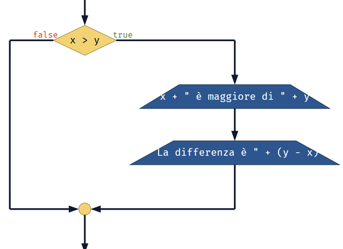

equivale in _Python_ a:

```python
if x > y:
  print(x, "è maggiore di", y)
  print("La differenza è", x - y)
```

Notare il due-punti a concludere la riga con `if`. Le istruzioni del ramo _vero_,
cioè quando effettivamente `x` è maggiore di `y`, vengono riportate indentate,
cioè **incolonnate verso destra di 2 spazi** rispetto alla colonna dell'`if`.
In questo modo _Python_ è in grado di riconoscere quali istruzioni fanno parte
del ramo _vero_ dell'`if` e quali no, cioè quali sono fuori dall'`if`.

Gli spazi dell'indentazione sono necessari e devono essere uguali per tutte le istruzioni
contenute nel ramo. **Non mettere gli spazi o mettere spazi non uguali è considerato un errore**.

#### Condizione con ramo else

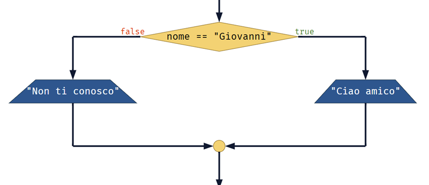

equivale in _Python_ a:

```python
if nome == "Giovanni":
  print("Ciao amico!")
else:
  print("Non ti conosco")
```

In questo caso vediamo la presenza del ramo `else`, cioè il ramo che viene eseguito quando
la condizione dell'`if` è _falsa_. Notare l'indentazione di entrambe le istruzioni `print`:
l'indentazione è necessaria.

#### Altre condizioni con elif

L'`if` può essere completato con ulteriori controlli e condizioni _else-if_, scritti `elif`.

```python
if nome == "Giovanni":
  print("Ciao amico!")
elif nome == "Laura":
  print("Ciao mamma!")
elif nome == "Carlo":
  print("Ciao papà!")
else:
  print("Non ti conosco")
```

All'`if` si possono aggiungere uno o più clausole `elif` che vengono controllate
e _scattano_ solo se nessuna sopra di esse è già scattata. Anche l'`else` può essere aggiunto
alla fine, ma è opzionale.

Il controllo avviene in cascata: prima controlla se il nome è _Giovanni_,
poi se è _Laura_, poi se è _Carlo_, e se non è nessuno di questi passa
nel ramo _else_, che non ha alcuna condizione.

L'esempio sopra stampa solo un messaggio, sempre solo e unicamente un messaggio.

### Espressioni booleane

Le condizioni sono molto simili a quelle _FlowRun_ e possono essere scritte con gli operatori:

| Codice  | Significato                     | Esempio             |
|---------|---------------------------------|---------------------|
| `==`    | Uguale (deve essere **doppio**) | `nome == "Anna"`    |
| `!=`    | Diverso                         | `a != b`            |
| `>`     | Maggiore                        | `x > 0`             |
| `>=`    | Maggiore o uguale               | `x >= 5`            |
| `<`     | Minore                          | `x < (y * 2)`       |
| `<=`    | Minore o uguale                 | `x <= 7`            |
| `in`    | Contenuto in                    | `n in [2, 3, 5, 7]` |

`in` serve per controllare se un elemento [è contenuto](#liste-e-controllo-elementi-di-una-lista) in una lista.
Funziona con variabili e liste di ogni tipo: intero, stringa, ...

Le condizioni possono essere poi composte insieme tramite operazioni
E (`and`), O (`or`) e NON (`not`) e, se necessario, parentesi tonde.

Alcuni esempi per comprendere meglio:

| Codice                        | Significato                                                                                                                                                  |
|-------------------------------|--------------------------------------------------------------------------------------------------------------------------------------------------------------|
| `a > b and c < d`             | Vera se `a` è maggiore di `b` E `c` è minore di `d`, cioè se sia la prima che la seconda condizione sono vere. Entrambe devono essere vere.                  |
| `nome == "Carlo" or a == b`   | Vera se `nome` è _Carlo_ O `a` è uguale a `b`, cioè se la prima condizione oppure la seconda condizione (o entrambe) sono vere. Almeno una deve essere vera. |
| `a > b and b > c and c > d`   | Tutte e 3 le condizioni devono essere vere.                                                                                                                  |
| `(a > b and b > c) or a == c` | Sia la prima che la seconda condizione deve essere vera, oppure la terza condizione deve essere vera.                                                        |
| `not a`                       | L'opposto di `a`, cioè se `a` è vero, varrà falso, e viceversa.                                                                                              |
| `a and not b`                 | Vero se `a` è vero e `b` è falso.                                                                                                                            |
| `x in numbers`                | Vero se `x` è contenuto nella lista dei numeri `numbers`.                                                                                                    |
| `name not in people`          | Vero se il nome `name` non è contenuto nella lista dei nomi `people`.                                                                                        |

### While

Così come il blocco _If_ visto precedentemente, anche il blocco _While_ introduce
una condizione che deve essere scritta in forma di espressione _vero_ o _falso_.

In _Python_, il blocco è espresso dall'istruzione `while`. Così come `if`, `while` richiede
una condizione e una o più istruzioni indentate, che vengono eseguite a ripetizione fino
a quando la condizione è _vera_.

Le condizioni vengono scritte esattamente come le condizioni per l'istruzione `if` (vedi sopra).

#### Ripetizione di esempio

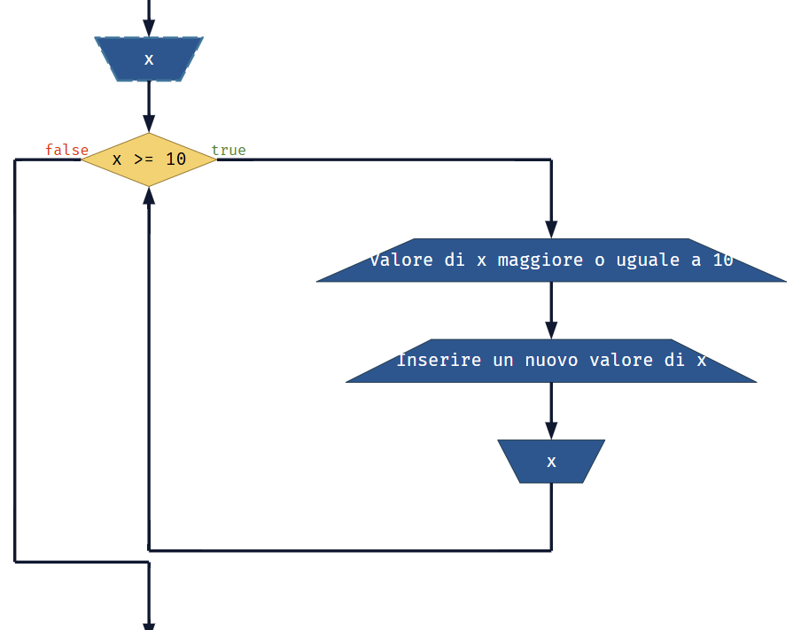

equivale in _Python_ a:

```
x = int(input())

while x >= 10:
  print("Valore di x maggiore o uguale a 10")
  print("Inserire un nuovo valore di x")
  x = int(input())
```

### Do … While

Non esiste codice equivalente per questo blocco in _Python_.

L'algoritmo deve essere modificato per esprimerlo attraverso un blocco `while` e non `do … while`,
e successivamente riscritto in _Python_ come spiegato sopra.

### Indentazione multipla

È possibile inserire istruzioni `if` dentro `while`, `if` dentro `if`, `while` dentro `while`, ecc…
_Python_ non pone limiti a quanto il codice può essere indentato, l'importante è che l'indentazione
sia ben ordinata e corrisponda alla logica che si vuole implementare.

Se ad esempio ogni blocco è indentato di 2 spazi, il primo livello deve essere indentato di 2 spazi,
il secondo di 4, il terzo di 6, …

L'indentazione è importantissima in _Python_ in quanto ha effetto su come il programma si comporta.
**Sbagliare l'indentazione produce degli errori** o un comportamento non corretto del programma.

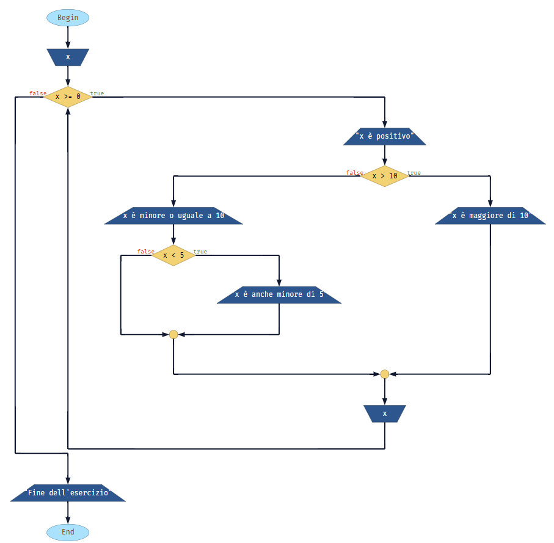

Questo esempio mostra 3 livelli di indentazione:

```python
x = int(input()) # Chiede un numero

while x >= 0:
  print("x è positivo")
  if x > 10:
    print("x è maggiore di 10")
  else:
    print("x è minore o uguale a 10")
    if x < 5:
      print("x è anche minore di 5")
  x = int(input())

print("Fine dell'esercizio")
```

### For

Il ciclo `for` in _Python_ è diverso da quello di _FlowRun_ e di altri linguaggi.
È molto più semplice ma allo stesso tempo avanzato. Non è necessario
specificare e gestire a mano una variabile contatore, è tutto automatico
e elegante, come del resto molte parti del linguaggio.

Il verbo che si usa in questo caso è _iterare_, cioè _passare elemento per elemento_.

#### Iterare su un intervallo di numeri

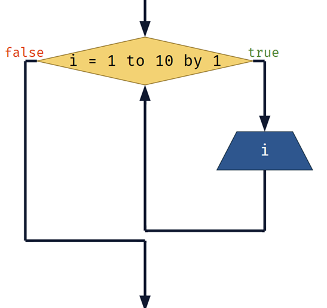

Il ciclo _For_ di _FlowRun_ può essere reso in _Python_ con:

```python
for i in range(1, 11):
  print(i)
```

Il contenuto del blocco _For_, la parte che viene ripetuta, va scritta come codice
indentato esattamente come per `if` e `while`. La variabile che
viene incrementata si specifica direttamente subito dopo il `for`, in questo
caso la variabile è `i`.

Nell'esempio `range(1, 11)` indica tutti i numeri da 1 a 11 (escluso),
cioè tutti i numeri da 1 a 10. Il `print` verrà eseguito 10 volte,
ogni volta con `i` con un valore diverso.

#### Iterare su liste

`for` opera in realtà su liste, dove `range(a, b)` può essere vista
come una lista particolare, tutti i numeri da `a` a `b` (escluso).

Non per forza questo è l'unico caso. Ad esempio:

```python
for i in [1, 4, 7, 10, -5, 3, 7]:
  print(i)
```

Il codice sopra è ugualmente valido, viene eseguito il `print`
per tutti i numeri della lista, in sequenza. `range` è solo
un caso speciale di lista.

La lista può anche essere contenuta in una variabile:

```python
numbers = [1, 4, 7, 10, -5, 3, 7] 

for i in numbers:
  print(i)
```

Oppure non essere neanche una lista di numeri.
In questo esempio salutiamo e chiediamo come stanno 4 persone.

```python
names = ["Marco", "Giovanni", "Chiara", "Laura"]

# Chiediamo a ogni persona come sta
for name in names:                                   
  print("Ciao", name) # saluta
  sto_bene = input("Come stai?") in ["Bene", "bene"] # chiede come stai?
  if sto_bene:
    print("Sono contento", name, "che tu stia bene")
  else:
    print("Mi dispiace, rimettiti presto", name)
```

## Altre istruzioni e funzioni di Python

### Liste e controllo elementi di una lista

_Python_, come tutti gli altri linguaggi di programmazione, permette di lavorare
su insieme di dati che vanno oltre le singole variabili, ad esempio i dizionari,
identificati da parentesi graffe `{ }` (che non useremo) e liste.

Le liste sono identificate da parentesi quadre `[ ]`.

Una lista può contenere molti elementi, ma anche nessuno.

Esempi di liste:

```python
a = [1, 2, 5, 9, 10, -5]                    # lista con alcuni numeri
b = [5, 5, 5, 5]                            # lista con numeri duplicati, è consentito
c = ["Ciao!"]                               # lista con un solo elemento
d = []                                      # lista vuota
e = [5, 3.14, 0, -9.75]                     # lista di numeri reali
f = ["Roma", "Milano", "Napoli", "Perugia"] # lista di stringhe
```

Sono tutte liste valide. Le liste possono contenere valori di ogni tipo.
È possibile mescolare i tipi, es `[1, "Ciao"]` ma andrebbe evitato.

Sulle liste si possono fare molte cose ma principalmente 2:

1. Verificare se un elemento è incluso in una lista, tramite operatore `in`.
   Esempio:

```python
citta = ["Roma", "Milano"]
if "Perugia" in citta:
  print("Bene")
else:
  print("Manca Perugia!")

if 10 in [0, 50, 10, 15]:
  print("10 è nella tabellina del 5")
```

2. Iterare con un `for` su una lista. Esempio:

```python
for citta in ["Roma", "Milano", "Napoli"]:
  print(citta, "è una città italiana")
```

Se la lista è vuota, il `for` non ha effetto.

```python
for x in []:
  print("Questo messaggio non verrà mai scritto")
  print("Neanche questo")
```

Le liste possono essere manipolate aggiungendo, cambiando e rimuovendo elementi,
ma in queste lezioni non useremo queste funzionalità.

### break

L'istruzione `break`, senza altri parametri, serve per interrompere immediatamente
il ciclo `for` o `while` nel quale è inserita senza completare né il ciclo corrente
né la verifica della condizione prima di far partire il ciclo successivo.

Serve normalmente come una scorciatoia.

Ad esempio, se abbiamo una lista di nomi `names` e vogliamo controllare
se questa lista contiene almeno 3 volte il nome `Chiara`, è inutile controllare
tutti i nomi dopo averne trovati già 3.

Possiamo contare i nomi e, una volta raggiunto 3, bloccare il ciclo con `break`.

```python
count = 0

for name in names:     # per ogni nome name contenuto in names
  if name == "Chiara": # se trovo il nome che cerco
    count = count + 1  # incremento il contatore
    if count >= 3:     # se ne ho trovati almeno 3
      break            # fermo il ciclo, non serve andare oltre
```

## Funzioni

_Python_ contiene migliaia di funzioni e può essere esteso attraverso migliaia di librerie esterne,
che a loro volta contengono spesso altre migliaia di funzioni. È un universo in rapida espansione.
Esiste una libreria e una funzione per ogni cosa, dall'accesso a internet all'analisi dati
dall'intelligenza artificiale al disegno 3D e ai videogiochi.

Ecco l'equivalente _Python_ di alcune funzioni di _FlowRun_:
- `randint(a, b)` - un numero casuale tra `a` e `b`.
- `len(s)` - la lunghezza della stringa `s`, ovvero di quanti caratteri è composta.
- `abs(n)` - il valore assoluto di `n`.
- `int(n)` - la parte intera di `n`, cioè `n` senza le sue cifre decimali.
- `round(n, d)` - arrotonda il valore di `n` a `d` cifre decimali, es. 2 cifre se `d` è uguale a 2.
- `sqrt(n)` - la radice quadrata di `n`.

Attenzione:
- per utilizzare `randint`, è necessario scrivere a inizio programma l'istruzione:
  `from random import randint`
- per utilizzare `sqrt`, è necessario scrivere a inizio programma l'istruzione:
  `from math import sqrt`

Le funzioni, come in matematica, si possono comporre, ad esempio:

```python
from math import sqrt

# Legge una stringa e la converte in intero
n = int(input("Inserisci un numero intero"))

# Ne calcola la radice quadrata e la arrotonda a 3 cifre decimali
sq = round(sqrt(n), 3)

print("La radice quadrata di", n, "arrotondata a 3 cifre decimali è", sq)
```

_Python_ è ben documentato: l’elenco completo di tutti i moduli (`from … import …`) e di tutte
le funzioni di ogni modulo è disponibile nella sconfinata
[documentazione online](https://docs.python.org/it/3). Oppure cercare con Google la funzione
che serve di volta in volta, facendo attenzione a specificare "python" nella ricerca,
ad esempio "lunghezza di una stringa in python".
