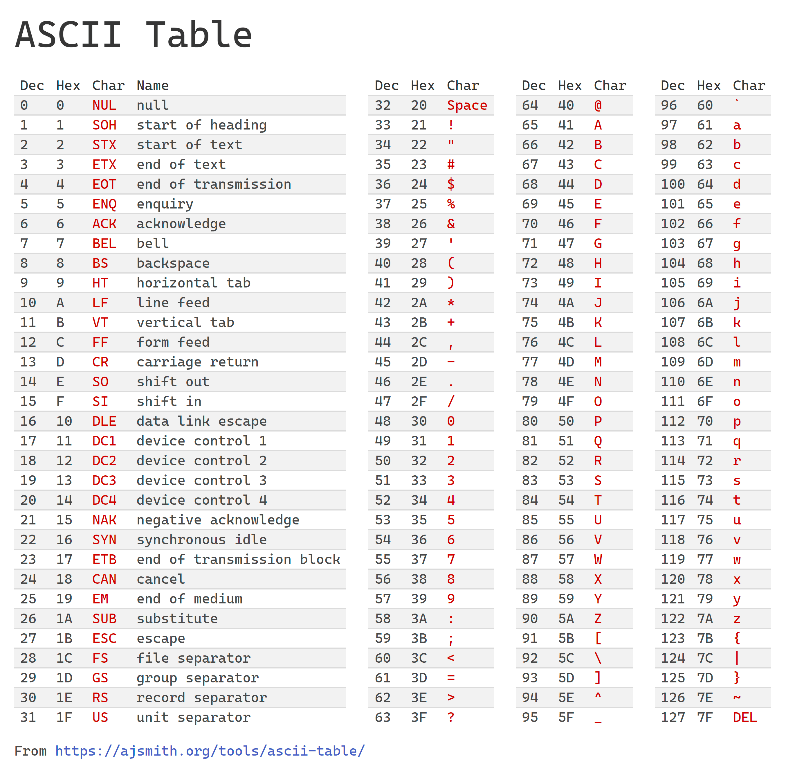
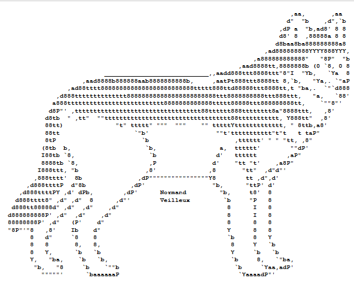

# Codifiche

Vediamo ora come è possibile codificare le informazioni
come testi, immagini, audio e video tramite _byte_.

Convenzionalmente, i _byte_ sono rappresentati sotto forma [esadecimale](../esadecimale/index.md).

1. TOC
{: toc }

## Bit

Si chiama [_bit_](https://it.wikipedia.org/wiki/Bit) qualcosa che può assumere solo valori `0` e `1`,
oppure `True` o `False`, o altri valori che hanno significato caso per caso,
ad esempio `presente` o `assente` in un appello a scuola, 
`acceso` o `spento` nel caso di una luce o di un dispositivo,
`bianco` o `nero` in una scacchiera, `presenza di segnale` o
`assenza di segnale` in un circuito elettronico, `testa` o `croce` nel lancio
di una moneta e molto altro.

Un valore _booleano_ può quindi essere rappresentato con un _bit_.

## Byte

Un [_byte_](https://it.wikipedia.org/wiki/Byte) è formato da 8 _bit_
ed è l'unità di misura fondamentale dell'informazione.

Calcolando tutte le possibili combinazioni di _zero_ e _uno_,
abbiamo visto che un _byte_ può contenere 256 possibili valori che,
convenzionalmente, rappresentano i numeri da **0** a **255** in decimale.
Tutti i possibili valori di un _byte_ possono anche essere rappresentati
in esadecimale, con i numeri a due cifre
[esadecimali](../esadecimale/index.md#contare-in-esadecimale) da **00** a **FF**.

Oltre ai numeri interi, è possibile rappresentare altro.

Vedremo che con un solo _byte_ è possibile rappresentare una lettera
dell'alfabeto latino, cioè l'alfabeto in comune alle lingue europee,
ad esempio `A`-`Z` ma anche minuscole `a`-`z` e altri simboli `!?+*` ...

Un _byte_ da solo non è sufficiente a fare molto. Si utilizzano spesso
molti più _byte_ messi insieme a formare quantità di informazioni sempre più grandi.

## KB, MB, GB e altre unità di misura

Si definiscono quindi le unità di misura nel
[Sistema Internazionale](https://it.wikipedia.org/wiki/Prefissi_del_Sistema_internazionale_di_unit%C3%A0_di_misura):

- **KB** (kilobyte) = 1.000 byte
- **MB** (megabyte) = 1.000 KB = 1.000.000 byte
- **GB** (gigabyte) = 1.000 MB = 1.000.000 KB = 1.000.000.000 byte
- **TB** (terabyte) = 1.000 GB = ...

Per motivi tecnici, essendo tutta l'informatica basata sulle potenze del 2,
esistono e vengono in realtà usate più spesso delle unità del Sistema Internazionale
riportate sopra anche le seguenti unità definite tramite i
[prefissi binari](https://it.wikipedia.org/wiki/Prefissi_per_multipli_binari):

- **KiB** (kibibyte) = 1.024 byte
- **MiB** (mebibyte) = 1.024 KiB = 1024² byte
- **GiB** (gibibyte) = 1.024 MiB = 1024³ byte
- **TiB** (tebibyte) = 1.024 GiB = ...

1.024 è una potenza del 2, cioè 2¹⁰, ed è una cifra _più tonda_ di 1.000
per un computer, mentre 1.000 è una cifra _più tonda_ per un umano.

Nella pratica, nessuno pronuncia mai _kibibyte_ o _mebibyte_ ma sempre _kilobyte_ e _megabyte_
intedendo a volte i multipli di 1.000 a volte i multipli di 1.024, facendo
una _gran confusione_. Se non specificato altrimenti, cioè se non si legge _KiB_ o _MiB_,
bisogna tentare di capire dal contesto quale delle due si intenda.

Sì, si fa una _gran confusione_.

## Codifica di testo ASCII

Vediamo ora come convertire i byte del testo.

Esiste una tabella, chiamata tabella ASCII, che associa a ogni lettera, numero,
simbolo un ben determinato byte. Per i caratteri più semplici questa tabella può bastare.



La tabella mostra come codificare alcuni caratteri (in rosso) tramite un singolo
_byte_, indicato sia come decimale (_dec_) che esadecimale (_hex_).
Useremo sempre la rappresentazione esadecimale 😅, quindi per semplicità
tralasceremo il prefisso `0x`.

La tabella è divisa in 4 parti:

- Caratteri da **00** a **1F**: non più utilizzati, venivano utilizzati
  da vecchi terminali e stampanti ad aghi secoli fa.
  Fanno eccezioni i caratteri **CR** e **LF** che servono per codificare l'andata a capo,
  ad esempio quando si preme _invio_ sulla tastiera.
  
- Caratteri da **20** a **3F**: alcuni simboli e numeri. Notate il carattere
  **20** che è il carattere _spazio_, quello che serve per separare parole
  e viene inserito premendo _spazio_ sulla tastiera. Non è uno spazio vuoto,
  è esso stesso un carattere.

- Caratteri da **40** a **5F**: lettere _maiuscole_.

- Caratteri da **60** a **7F**: lettere _minuscole_.

La tabella contiene metà dei valori possibili per un _byte_, cioè 128 caratteri.
L'intervallo da **80** a **FF** non è presente. Esistono tabelle che estendono
la tabella ASCII con altri 128 caratteri, ma è una tecnica che non si usa più,
soppiantata da Unicode (vedi di [seguito](#codifica-di-testo-unicode)).

### Il mio nome in ASCII

Codifichiamo il nostro nome in ASCII! Ad esempio _Mario Rossi_ è scritto così:

```text
4D 61 72 69 6F 20 52 6F 73 73 69
```

Notate il _byte_ **20** usato per codificare lo spazio fra _Mario_ e _Rossi_.
Notate anche il _byte_ **73** ripetuti 2 volte di file: solo le doppie **s** di _Rossi_.

### ASCII Art!

Curiosità: mai sentito parlare di [ASCII art](https://it.wikipedia.org/wiki/ASCII_art)?

C'è chi disegna immagini usando solo caratteri!
Il nome di ASCII Art deriva proprio dalla tabella ASCII.



L'immagine viene da [qui](https://asciiart.website/art/787).

Ci sono siti che convertono foto in ASCII art. Cercateli con Google.

## Codifica di testo Unicode
_(in via di pubblicazione)_

## Codifica di una immagine
_(in via di pubblicazione)_

## Codifica di un audio
_(in via di pubblicazione)_

## Codifica di un video
_(in via di pubblicazione)_