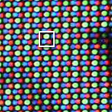
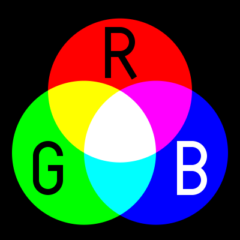

# Codifiche

Vediamo ora come è possibile codificare le informazioni
come testi, immagini, audio e video tramite _byte_.

Convenzionalmente, i _byte_ sono rappresentati sotto forma [esadecimale](../esadecimale/index.md).

1. TOC
{: toc }

## Bit

Si chiama [_bit_](https://it.wikipedia.org/wiki/Bit) qualcosa che può assumere solo valori `0` e `1`,
oppure `True` o `False`, o altri valori che hanno significato caso per caso,
ad esempio `presente` o `assente` in un appello a scuola, 
`acceso` o `spento` nel caso di una luce o di un dispositivo,
`bianco` o `nero` in una scacchiera, `presenza di segnale` o
`assenza di segnale` in un circuito elettronico, `testa` o `croce` nel lancio
di una moneta e molto altro.

Un valore _booleano_ può quindi essere rappresentato con un _bit_.

## Byte

Un [_byte_](https://it.wikipedia.org/wiki/Byte) è formato da 8 _bit_
ed è l'unità di misura fondamentale dell'informazione.

Calcolando tutte le possibili combinazioni di _zero_ e _uno_,
abbiamo visto che un _byte_ può contenere 256 possibili valori che,
convenzionalmente, rappresentano i numeri da **0** a **255** in decimale.
Tutti i possibili valori di un _byte_ possono anche essere rappresentati
in esadecimale, con i numeri a due cifre
[esadecimali](../esadecimale/index.md#contare-in-esadecimale) da **00** a **FF**.

Oltre ai numeri interi, è possibile rappresentare altro.

Vedremo che con un solo _byte_ è possibile rappresentare una lettera
dell'alfabeto latino, cioè l'alfabeto in comune alle lingue europee,
ad esempio `A`-`Z` ma anche minuscole `a`-`z` e altri simboli `!?+*` ...

Un _byte_ da solo non è sufficiente a fare molto. Si utilizzano spesso
molti più _byte_ messi insieme a formare quantità di informazioni sempre più grandi.

## KB, MB, GB e altre unità di misura

Si definiscono quindi le unità di misura nel
[Sistema Internazionale](https://it.wikipedia.org/wiki/Prefissi_del_Sistema_internazionale_di_unit%C3%A0_di_misura):

- **KB** (kilobyte) = 1.000 byte
- **MB** (megabyte) = 1.000 KB = 1.000.000 byte
- **GB** (gigabyte) = 1.000 MB = 1.000.000 KB = 1.000.000.000 byte
- **TB** (terabyte) = 1.000 GB = ...

Per motivi tecnici, essendo tutta l'informatica basata sulle potenze del 2,
esistono e vengono in realtà usate più spesso delle unità del Sistema Internazionale
riportate sopra anche le seguenti unità definite tramite i
[prefissi binari](https://it.wikipedia.org/wiki/Prefissi_per_multipli_binari):

- **KiB** (kibibyte) = 1.024 byte
- **MiB** (mebibyte) = 1.024 KiB = 1024² byte
- **GiB** (gibibyte) = 1.024 MiB = 1024³ byte
- **TiB** (tebibyte) = 1.024 GiB = ...

1.024 è una potenza del 2, cioè 2¹⁰, ed è una cifra _più tonda_ di 1.000
per un computer, mentre 1.000 è una cifra _più tonda_ per un umano.

Nella pratica, nessuno pronuncia mai _kibibyte_ o _mebibyte_ ma sempre _kilobyte_ e _megabyte_
intedendo a volte i multipli di 1.000 a volte i multipli di 1.024, facendo
una _gran confusione_. Se non specificato altrimenti, cioè se non si legge _KiB_ o _MiB_,
bisogna tentare di capire dal contesto quale delle due si intenda.

Sì, si fa una _gran confusione_.

## Codifica di testo ASCII

Vediamo ora come convertire i byte del testo.

Esiste una tabella, chiamata tabella ASCII, che associa a ogni lettera, numero,
simbolo un ben determinato byte. Per i caratteri più semplici questa tabella può bastare.


La tabella mostra come codificare alcuni caratteri (in rosso) tramite un singolo
_byte_, indicato sia come decimale (_dec_) che esadecimale (_hex_).
Useremo sempre la rappresentazione esadecimale 😅, quindi per semplicità
tralasceremo il prefisso `0x`.

La tabella è divisa in 4 parti:

- Caratteri da **00** a **1F**: non più utilizzati, venivano utilizzati
  da vecchi terminali e stampanti ad aghi secoli fa.
  Fanno eccezioni i caratteri **CR** e **LF** che servono per codificare l'andata a capo,
  ad esempio quando si preme _invio_ sulla tastiera.
  
- Caratteri da **20** a **3F**: alcuni simboli e numeri. Notate il carattere
  **20** che è il carattere _spazio_, quello che serve per separare parole
  e viene inserito premendo _spazio_ sulla tastiera. Non è uno spazio vuoto,
  è esso stesso un carattere.

- Caratteri da **40** a **5F**: lettere _maiuscole_.

- Caratteri da **60** a **7F**: lettere _minuscole_.

La tabella contiene metà dei valori possibili per un _byte_, cioè 128 caratteri.
L'intervallo da **80** a **FF** non è presente. Esistono tabelle che estendono
la tabella ASCII con altri 128 caratteri, ma è una tecnica che non si usa più,
soppiantata da Unicode (vedi di [seguito](#codifica-di-testo-unicode)).

### Il mio nome in ASCII

Codifichiamo il nostro nome in ASCII! Ad esempio _Mario Rossi_ è scritto così:

```text
4D 61 72 69 6F 20 52 6F 73 73 69
```

Notate il _byte_ **20** usato per codificare lo spazio fra _Mario_ e _Rossi_.
Notate anche il _byte_ **73** ripetuto 2 volte di file: solo le doppie **s** di _Rossi_.

### ASCII Art!

Curiosità: mai sentito parlare di [ASCII art](https://it.wikipedia.org/wiki/ASCII_art)?

C'è chi disegna immagini usando solo caratteri!
Il nome di ASCII Art deriva proprio dalla tabella ASCII.


L'immagine viene da [qui](https://asciiart.website/art/787).

Ci sono siti che convertono foto in ASCII art. Cercateli con Google.

## Codifica di testo Unicode

L'ASCII permette di rappresentare in _byte_ del testo formato da caratteri _semplici_:
lettere maiuscole e minuscole, punteggiatura, parentesi e numeri. Questo è però
troppo limitativo, pensate ad esempio alle lettere italiane accentate **ÀÈÌÒÙ**
o con accento **É** (perch**é**, poich**é**) ma anche **ÄÖÜ** in tedesco,
caratteri come **Ñ** in spagnolo, le legature francesi
[**Œ**](https://it.wikipedia.org/wiki/%C5%92)
ed [**Æ**](https://it.wikipedia.org/wiki/%C3%86) o altri alfabeti come
il [greco](https://it.wikipedia.org/wiki/Alfabeto_greco),
il [cirillico](https://it.wikipedia.org/wiki/Alfabeto_cirillico) usato per russo, ucraino, serbo, bulgaro, ...
o anche l'[arabo](https://it.wikipedia.org/wiki/Alfabeto_arabo) (أبجدية عربية),
gli alfabeti giapponesi [Katakana](https://it.wikipedia.org/wiki/Katakana) (片仮名)
e [Hiragana](https://it.wikipedia.org/wiki/Hiragana) (平仮名),
gli ideogrammi giapponesi [Kanji](https://it.wikipedia.org/wiki/Kanji) (漢字)
e [cinesi](https://it.wikipedia.org/wiki/Lingua_cinese)
semplificati (汉语) e tradizionali (漢語) e molti altri caratteri e alfabeti,
fino a geroglifici, simboli runici e migliaia di altri casi speciali.

Anche le emoji 😅😂😍👌 sono caratteri!

Il sistema per rappresentare tutti questi caratteri si chiama [Unicode](https://home.unicode.org/)
ed è usato ormai ovunque in informatica e su Internet.

Unicode è una enorme tabella separata in alfabeti che contiene più di 150.000 caratteri
e cresce di anno in anno. Ogni anno si aggiungono nuovi caratteri e emoji.

### Alfabeti e caratteri

Ogni carattere (_code point_ secondo la terminologia Unicode) è rappresentato da un codice
esadecimale da 4-5 cifre spesso indicato con il prefisso **U+**. Ecco alcuni caratteri di esempio:

- **Ä** (U+00C4), **ü** (U+00FC), **Ď** (U+010E)
- **Δ** (U+0394), **Ψ** (U+03A8), **β** (U+03B2)
- **И** (U+0418), **ж** (U+0436), **Я** (U+042F)
- 💔 (U+1F494), 🥰 (U+1F970), 🦔 (U+1F994), 🔥 (U+1F525)

L'intera tabella è visibile su [questo sito](https://symbl.cc/it/unicode-table/).
Le emoji invece si possono esplorare su [Emojipedia](https://emojipedia.org/it)!

Analizziamo la stringa **💔 perché? 🥹**

1. Andiamo su [unicode.run](https://unicode.run/)
2. Scriviamo il testo, possiamo fare copia-incolla.
3. Verifichiamo che _Show Below_ sia impostato su _Hex Code Point_.

Vediamo che la stringa contiene i seguenti **11** caratteri:

1.  U+1F494 BROKEN HEART (💔)
2.  U+0020 SPACE
3.  U+0070 LATIN SMALL LETTER P
4.  U+0065 LATIN SMALL LETTER E
5.  U+0072 LATIN SMALL LETTER R
6.  U+0063 LATIN SMALL LETTER C
7.  U+0068 LATIN SMALL LETTER H
8.  U+00E9 LATIN SMALL LETTER E WITH ACUTE (**é**)
9.  U+003F QUESTION MARK
10. U+0020 SPACE
11. U+1F979 FACE HOLDING BACK TEARS (🥹)

_Speriamo non sia successo nulla di grave._

### Codifica UTF-8

Come si codifica un testo che contiene caratteri Unicode in _byte_?
Esistono più sistemi ma quello di gran lunga più utilizzato si chiama UTF-8.

Ogni caratte Unicode, sia semplice che più complesso come una emoji,
si converte in _byte_ con una procedura complessa che fa si che
il carattere venga scritto con _uno o più bytes_.

{: .highlight }
I caratteri che hanno un corrispondente ASCII utilizzano lo stesso
_byte_ usato nella tabella ASCII. I caratteri accentati vengono scritti
con 2 _byte_ e spesso alfabeti più complessi e emoji vengono scritti
con 2, 3 o anche 4 _byte_.

Per convertire da testo a _sequenza di byte UTF-8_ utilizziamo di nuovo
il sito [unicode.run](https://unicode.run/) in quanto le regole di conversione
sono troppo complesse per essere applicate a mano.

1. Andiamo su [unicode.run](https://unicode.run/).
2. Scriviamo il testo **💔 perché? 🥹** facendo copia-incolla.
3. Impostiamo _Show Below_ a _UTF-8_.

Vediamo come i caratteri vengono codificati in _byte_:

1.  **F0 9F 92 94** BROKEN HEART (💔)
2.  **20** SPACE
3.  **70** LATIN SMALL LETTER P
4.  **65** LATIN SMALL LETTER E
5.  **72** LATIN SMALL LETTER R
6.  **63** LATIN SMALL LETTER C
7.  **68** LATIN SMALL LETTER H
8.  **C3 A9** LATIN SMALL LETTER E WITH ACUTE (é)
9.  **3F** QUESTION MARK
10. **20** SPACE
11. **F0 9F A5 B9** FACE HOLDING BACK TEARS (🥹)

Notiamo che:

- I caratteri semplici come lo _spazio_, il _punto interrogativo_ e le lettere **p e r c h**
  sono codificati con un solo _byte_ che corrisponde a quello della tabella ASCII.
- Il carattere **é** è codificato con 2 _byte_.
- Le emoji 💔🥹 sono codificate ognuna con 4 _byte_.

Quindi la stringa **💔 perché? 🥹** formata da **11** caratteri
è salvata su file o trasmessa su internet con la sequenza di **18** _byte_:

```text
F0 9F 92 94 20 70 65 72 63 68 C3 A9 3F 20 F0 9F A5 B9
```

{: .highlight }
Attenzione: i byte UTF-8 non corrispondono ai codici dei caratteri Unicode,
quelli che iniziano con **U+**! In un certo senso _gli assomigliano_ ma non sono
gli stessi. E se si volesse capire come funziona veramente l'algoritmo di conversione?
È spiegato [qui](https://it.wikipedia.org/wiki/UTF-8#Descrizione_tecnica).

## Codifica dei colori RGB

Possiamo rappresentare i colori con 3 componenti fondamentali:

- **R**ed
- **G**reen
- **B**lue

Gli schermi elettronici sono composti da _pixel_, cioè [puntini luminosi](https://it.wikipedia.org/wiki/Pixel).
Ogni _pixel_ è in realtà composto da 3 _subpixel_, cioè [sotto-pixel](https://it.wikipedia.org/wiki/Sub-pixel),
uno rosso, uno verde e uno blù. L'occhio umano non riesce a distinguere questi _subpixel_
se non con una lente di ingrandimento.



L'occhio umano vede i 3 colori mescolati, e percepisce tutti i colori visibili
in quanto ogni colore è il risultato di aver mescolato rosso, verde o blù in combinazioni diverse.



Le componenti RGB sono separate e ognuna può avere un valore che va da _0_ a _255_,
dove con _0_ si intende _spento_ e con _255_ si intende _massima intensità_.

Naturalmente i numeri _0_ e _255_ non sono casuali. Corrispondono in esadecimale ai numeri **00** e **FF**.
Ogni componente di un colore RGB può essere rappresentata con un _byte_.

{: .highlight }
Un _pixel_ di uno schermo a colori può essere rappresentato con 3 _byte_.

I colori si rappresentano con 3 byte separati, es. **(10, 9C, EB)** oppure
la sintassi abbreviata **#109CEB**, usata molto sul web in quanto
è quella dei linguaggi [HTML](https://www.html.it/guide/guida-html/) e [CSS](https://www.html.it/guide/guida-css-di-base/).
Il primo _byte_ è il rosso, il secondo il verde, il terzo il blù.

Alcune combinazioni di colori:

- Rosso + verde = Giallo **#FFFF00**
- Rosso + blù = Magenta **#FF00FF**
- Verde + blù = Ciano **#00FFFF**
- Rosso + verde + blù = Bianco **#FFFFFF**

Il nero si ottiene non mescolando alcun colore **#000000**.
Tutte le gradazioni intermedie si ottengono mescolando i componenti RGB
in quantità diverse, es. **#FF8000** è arancione
mentre **#0080FF** è azzurro intenso.

Il grigio si ottiene come via di mezzo fra bianco e nero, cioè con tutti
i componenti RGB alla stessa intensità, e anche esso può avere tante gradazioni, es:

- Nero **#000000**
- Grigio scuro **#404040**
- Grigio intermedio **#808080**
- Grigio chiaro **#C0C0C0**
- Bianco **#FFFFFF**

Provare di persona usando un sito come [RGB Color Picker](https://rgbcolorpicker.com/).

## Codifica di una immagine
_(in via di pubblicazione)_

## Codifica di un audio
_(in via di pubblicazione)_

## Codifica di un video
_(in via di pubblicazione)_