# Diagrammi di flusso con FlowRun

Breve guida per capire e utilizzare FlowRun
e scrivere semplici algoritmi e programmi tramite diagrammi di flusso.

1. TOC
{: toc }

## Utilizzo

Aprire FlowRun all'indirizzo [flowrun.io](https://flowrun.io).
Selezionare _Start coding_. Apparirà questa schermata:

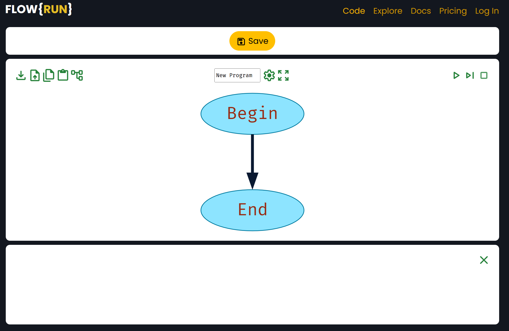

Per rimpostare un layout più comodo, selezionare l'icona delle opzioni
del programma e selezionare l'opzione _Show functions_.

Selezionare poi una freccia, ad esempio all'inizio l'unica presente
fra _Begin_ e _End_, e selezionare quale blocco inserire fra quelli proposti dal programma:

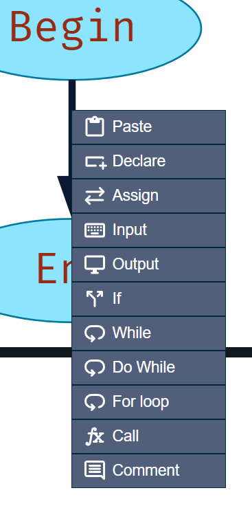

## Come e quali blocchi utilizzare

FlowRun differisce dagli schemi spesso fatti alla lavagna in quanto necessita
di una dichiarazione esplicita delle variabili usate (blocco _Declare_)
e dal fatto che non permette alle frecce di essere disegnate
e connesse a piacere con i blocchi.

### Declare (dichiarazione)

Il blocco _Declare_ introduce, cioè dichiara, nel programma una variabile,
che può avere un nome a piacere (senza spazi) come ad esempio, `x`, `y`, `z`,
`nome`, `numero`, `base`, `altezza` o qualunque altro nome.

Maiuscole e minuscole fanno differenza, `Nome` è diverso da `nome`,
quindi per non confondersi conviene scegliere una convenzione e mantenerla
per tutto il diagramma. Ad esempio consiglio di scrivere sempre _in minuscolo_.

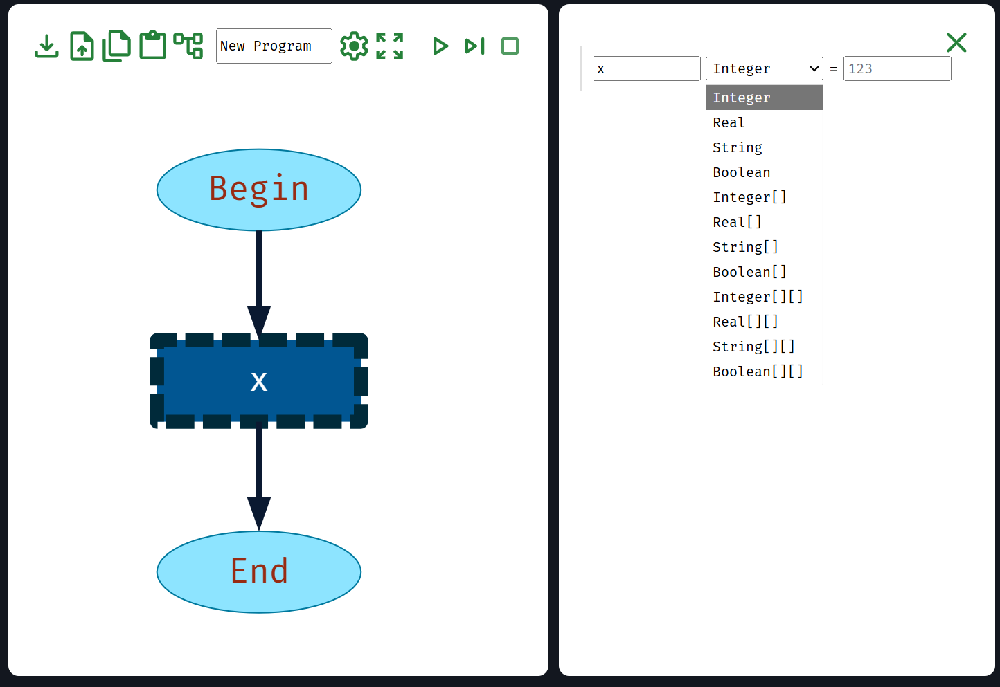

Nel primo campo, digitare il nome della variabile che si vuole introdurre nel programma,
in questo caso `x`.

Nel secondo campo, bisogna scegliere il tipo della variabile.
Ogni variabile ha un tipo, concetto comune in molti linguaggi di programmazione.
Dovete dire che tipo di dati verrà memorizzato nelle variabili dichiarate.

Possibili tipi:
- _Integer_: numeri interi come `0`, `1`, `2`, `3`, …, `-4`, `-5`, … 
- _Real_: numeri con la virgola come `0`, `1.5`, `3.14`, `-2.79`, …
- _String_: del testo come `"Roma"`, `"Italia"`, `"lunedì"`, `"Giovanni"`, `"casa"`, `"scuola"`, …
- _Boolean_: può assumere solo il valore vero (`true`) o falso (`false`).

Nel caso dei numeri, selezionate sempre _Integer_ a meno che
non ci siano motivi validi per selezionare _Real_.

Attenzione: la virgola decimale è sostituita dal punto `.` secondo la convenzione anglosassone.
Le stringhe, cioè il testo, devono sempre essere incluse fra virgolette `"…"`.

Ignoriamo per ora i tipi che contengono le parentesi quadre `[]`:
questi sono array e matrici che non ha molto senso usare qui nei diagrammi
ma dopo nel codice _Python_, tramite tipi dedicati come `list`.

Quando il programma viene eseguito e si raggiunge un blocco _Declare_,
la variabile dichiarata inizia a esistere nello stato del programma.
Se si tenta di utilizzare la variabile prima che questa sia dichiarata,
si riceve un messaggio d'errore.

{: .highlight }
In FlowRun, quando si dichiara una variabile, questa inizialmente
non avrà alcun valore, si dice cioè che _non è inizializzata_.
Usare una variabile non inizializzata genera un errore.

Una variabile può e, quando possibile, deve essere inizializzata
al momento della sua dichiarazione impostandone il valore nel terzo campo,
in questo campo l'espressione `a + 20`.

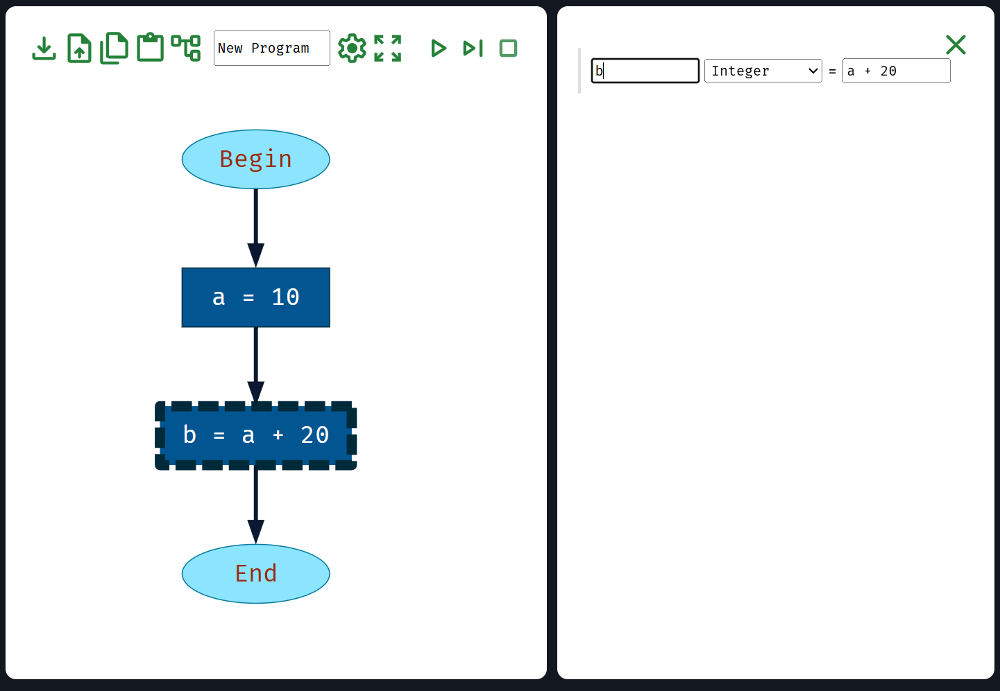

I possibili valori possono essere sia delle costanti sia delle
espressioni composte da altre variabili, es:

- `0`, `false`, `""`, …
- `a + b`, `"Ciao " + nome`, `sum / count`, `x + 1`, …

Attenzione alle costanti booleane `true` e `false`:
queste devono essere scritte senza virgolette `"…"`, in quanto non sono
stringhe ma valori speciali. Non confondere `true` con `"true"` e `false` con `"false"`.

Nelle espressioni è possibile utilizzare le operazioni:
- `+` addizione per numeri e concatenazione per stringhe.
- `-` sottrazione.
- `*` moltiplicazione.
- `/` divisione, sia per numeri interi che per numeri reali.
- `%` resto della divisione nel caso di numeri interi, detto _modulo_.

È possibile anche usare le parentesi tonde `(` e `)` come nelle espressioni matematiche.
Se sono necessari più livelli di parentesi, usate sempre le tonde, non le quadre
o le graffe, es. `((a + b) * c - d) / e`, FlowRun e i linguaggi di programmazione
riescono a comprendere di quello che si vuole indicare. Parentesi quadre e graffe
hanno altri usi.

### Input (lettura) e Output (scrittura)

I blocchi _Input_ e _Output_ chiedono all'utente (lettura) o comunicano
all'utente (scrittura) il valore di una variabile o, in generale, scrivono
un'espressione nella _console_ del programma, il testo sulla destra o in basso
che il programma scrive e dove l'utente scrive gli input.

Durante la lettura, l'utente inserisce un valore e questo viene assegnato alla variabile,
sovrascrivendo l'eventuale valore precedente memorizzato in precedenza.
Nell'esempio viene letta la variabile _name_. La variabile deve essere stata dichiarata in precedenza.

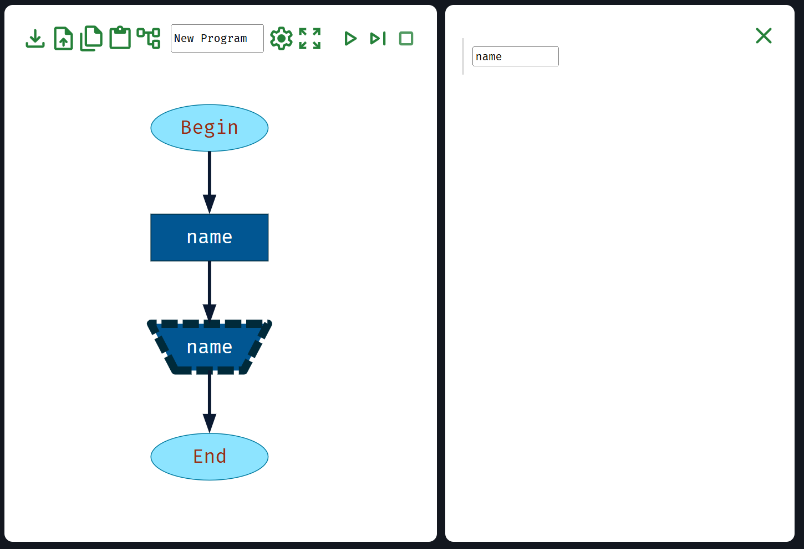

Durante la scrittura, il valore della variabile viene comunicato all'utente,
lasciando la variabile inalterata. È un errore scrivere una variabile se a questa
non è stato ancora assegnato un valore. Nell'esempio viene scritta la variabile `x`.

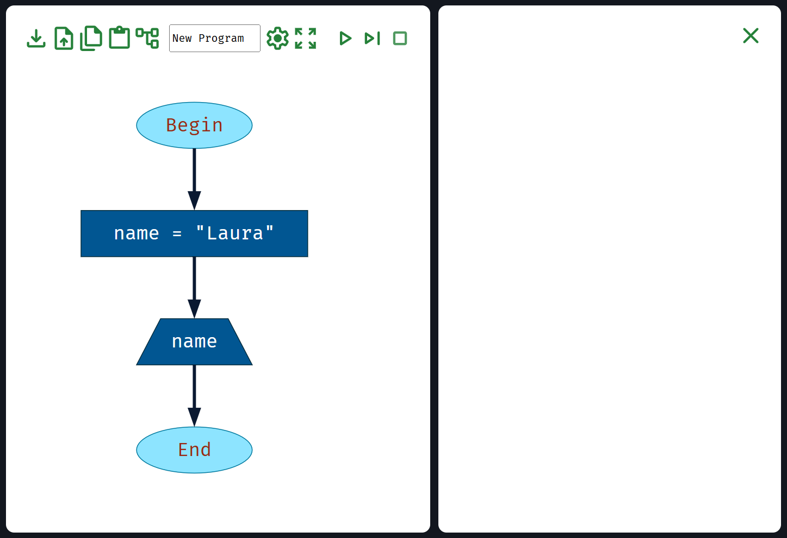

È anche possibile scrivere un'espressione, intesa come valore composto da una
o più variabili, ad esempio `x + y` oppure `"Ciao " + nome` se `nome` è una variabile
di tipo stringa. Il programma scriverà la somma o la concatenazione delle due variabili.

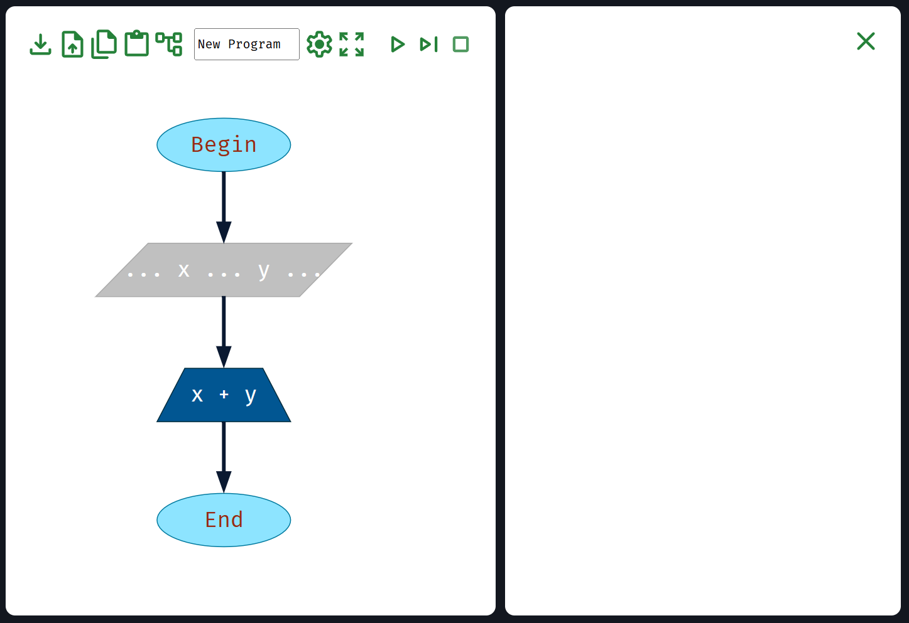

### Assign (assegnazione)

L'assegnazione imposta una variabile a un determinato valore, cioè assegna
quel valore alla variabile già dichiarata. Abbiamo visto che questo è anche possibile tramite il blocco
_Input_, tramite cui alla variabile viene assegnato un valore dato dall'utente.
Con il blocco _Assign_ invece il valore viene calcolato dal programma.

L'assegnazione può essere usata per assegnare a una variabile un valore,
come nell'esempio seguente `c = a + b`. La variabile `c` deve esistere,
cioè deve essere stata dichiarata in precedenza. 

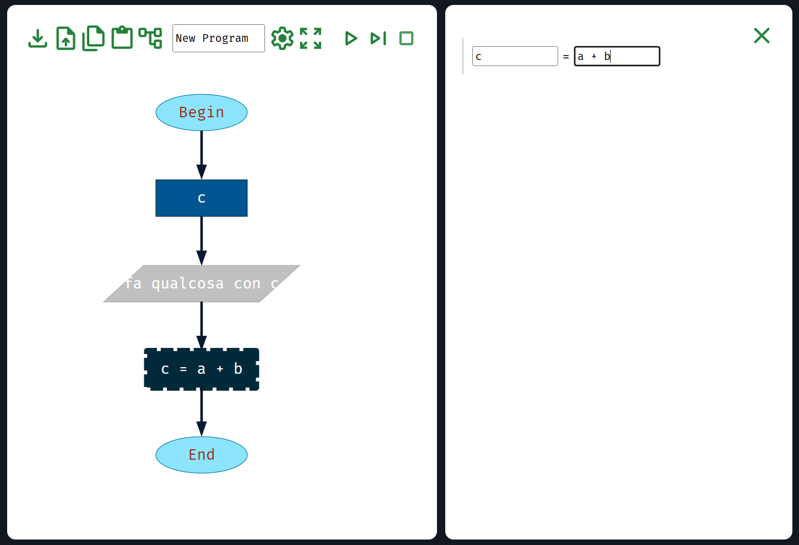

È possibile usare qualunque espressione, anche complessa, in un'assegnazione.

{: .highlight }
Non dichiarare una variabile per poi assegnarle un valore subito dopo.
Specifica direttamente quel valore nel blocco _Declare_.

L'assegnazione è per cambiare valore a una variabile preesistente.
Si può usare il valore della stessa variabile poco prima che questa
cambi valore, ad esempio nel caso `n = n + 1`, che incrementa
la variabile `n` di uno.

### If (se … fai … altrimenti fai …)

Valuta una condizione, cioè un'espressione o una domanda che può avere
solo risposta _vero_ o _falso_. In caso _vero_, il programma prosegue con i blocchi
sulla destra. In caso _falso_, il programma prosegue con i blocchi sulla sinistra.
Al termine il programma continua dritto.

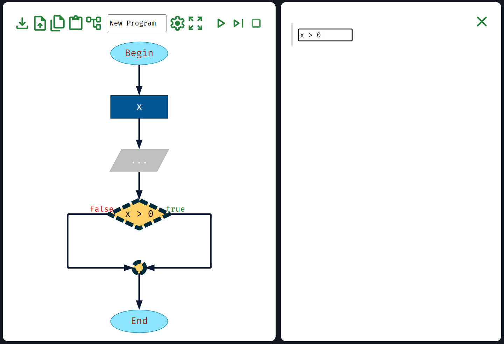

L'espressione ha tipicamente una forma che può avere solo risposta _vero_ o _falso_,
ad esempio `x > 0`, `x > y`, `x == y`, `country == "Italia"`, …

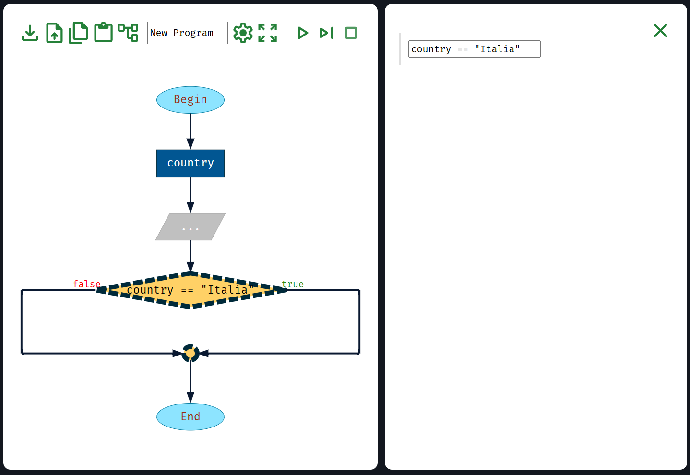

Non sono espressioni valide: `x + y`, `x - 5`, … in quanto la loro risposta
non può essere solo _vero_ o _falso_, non sono cioè valide espressioni booleane.

Le condizioni possono essere scritte con gli operatori:
- `==` uguale
- `!=` diverso
- `>` maggiore, `>=` maggiore o uguale
- `<` minore, `<=` minore o uguale

Le condizioni possono essere composte insieme tramite operazioni **not** (`!`), **and** (`&&`) e **or** (`||`).

Alcuni esempi per comprendere meglio:
- `a > b && c < d`, vera se `a` è maggiore di `b` **E** `c` è minore di `d`,
  cioè se sia la prima che la seconda condizione sono vere. Entrambe devono essere vere (**and**).
- `name == "Carlo" || a == b`, vera se `name` è Carlo **O** `a` è uguale a `b`,
   cioè se la prima condizione oppure la seconda condizione (o entrambe) sono vere (**or**).
   Almeno una deve essere vera.
- `a > b && b > c && c > d`, tutte e 3 le condizioni devono essere vere.
- `(a > b && b > c) || a == c`, sia la prima che la seconda condizione devono essere vere (**and**),
  oppure la terza condizione deve essere vera (**or**).
- `! valid`, ad esempio se esiste una variabile `valid` booleana e in questo caso
  la condizione è vera se questa variabile è falsa.

### While (finchè … fai …)

Per comprendere meglio questo blocco, immaginare si chiami _finché_, che è una traduzione
in italiano di _mentre_ più adatta a rappresentare il comportamento del blocco.

Così come il blocco _If_ visto in precedenza, il blocco _While_ introduce
una condizione che deve essere scritta in forma di espressione _vero_ o _falso_,
cioè un'espressione booleana. Nell'esempio riportato si chiede se `x` sia diverso da zero.

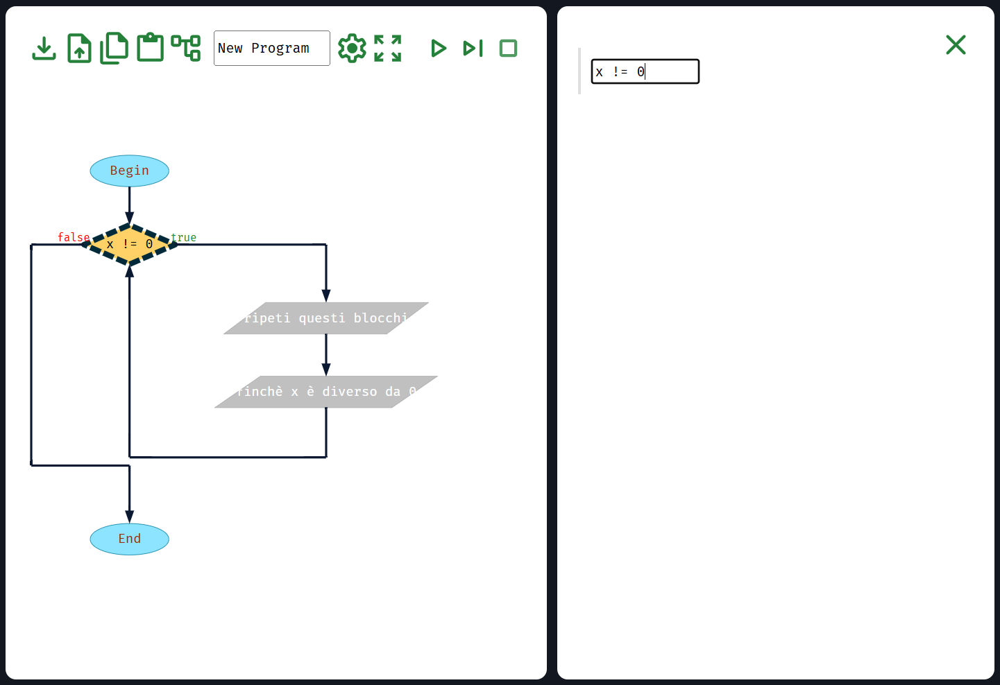

Ricordatevi che `!=` significa _diverso da_. Si possono naturalmente usare
tutti gli operatori booleani e le parentesi come illustrato nel paragrafo precedente.

Il blocco introduce una ripetizione (loop). I blocchi sulla destra vengono ripetuti
finché la condizione è _vera_. La condizione viene valutata all'inizio di ogni ripetizione.
Si ripete fino a quando la condizione rimane _vera_, cioè finché `x` è diverso da zero.

Quando la condizione diventa _falsa_, il ciclo si interrompe e il programma continua
dopo il ciclo. Se la condizione è _falsa_ fin dall'inizio, i blocchi sulla destra
non vengono eseguiti neanche una volta.

### Do … While (fai … finchè …)

Così come il blocco _While_ visto precedentemente, il blocco _Do While_ introduce
una condizione che deve essere scritta in forma di espressione _vero_ o _falso_,
nell'esempio riportato si chiede se `x` sia maggiore di `5`.

Il blocco introduce una ripetizione (loop). I blocchi sulla destra vengono ripetuti
finché la condizione è _vera_. La condizione viene valutata alla fine di ogni ripetizione.
Si ripete fino a quando la condizione rimane _vera_.

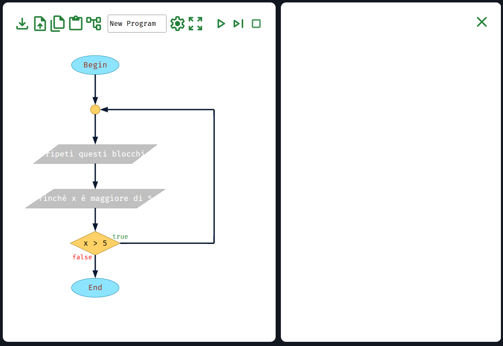

Quando la condizione diventa _falsa_, il ciclo si interrompe e il programma continua
dopo il ciclo. I blocchi sopra la condizione vengono eseguiti almeno una volta,
anche se la condizione è _falsa_ fin dall'inizio: questa è la differenza fondamentale tra
_While_ e _Do While_. In questo caso il contenuto del blocco viene eseguito almeno una volta.
Nel caso di _While_ è possibile che il contenuto non venga mai eseguito.

{: .highlight }
Il loop _Do While_ in pratica si usa poco e non tutti i linguaggi hanno questa
funzionalità. Ad esempio _Python_ non lo supporta ma, se necessario, si può
scrivere con le istruzioni `while`, `if` e `break`. Consiglio di non usarlo mai.

### For (conta da … a … facendo …)

Il blocco _For_ ripete le istruzioni sulla destra un determinato numero di volte.
Introduce una variabile, tipicamente chiamata `i`, un contatore,
che viene inizializzato a un numero, tipicamente `0`, e incrementato ogni volta
di `1` fino a raggiungere un valore massimo (incluso) impostato nell'esempio a `10`.

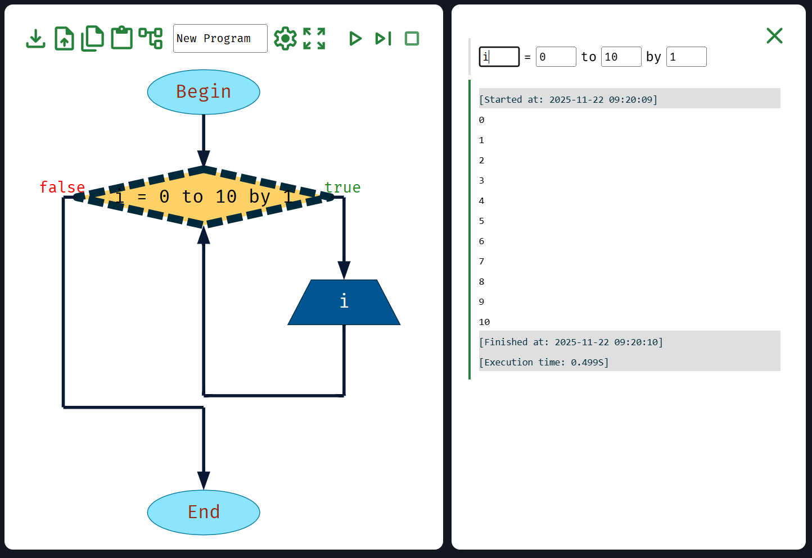

In questo caso il blocco viene ripetuto 11 volte. Il contatore `i` è una
variabile vera e propria gestita e incrementata dal blocco _For_ che può
essere usata nelle istruzioni ripetute, es. se messa in un'istruzione _Output_
questa stamperà tutti i numeri da 0 a 10, come nell'esempio.

Sia il valore di inizio, di fine e l'incremento possono essere espressioni,
es. si può chiedere all'utente fino a che numero `n` contare
e poi usare `n` come valore massimo nel blocco _For_.

{: .highlight }
Quando usare _While_? Quando usare _For_? Usare _While_ quando il numero
di ripetizioni non è noto a priori, es. _finché l'utente non scrive zero_.
Usare _For_ quando il numero di ripetizioni è noto, es. _ripeti 10 volte_
oppure anche _ripeti n volte_ dove _n_ è una variabile: il valore di _n_
non è noto finché il programma non viene eseguito ma quando viene eseguito
il valore di _n_ è noto e il numero di ripetizioni è quindi fissato a _n_.

## Funzioni

FlowRun riconosce alcune funzioni che possono essere usate nelle espressioni di
inizializzazione di una variabile, di assegnazione, di _Output_ e nelle espressioni condizionali.

Alcuni esempi:
- `randomInt(n)` - un numero casuale tra `0` e `n`.
- `length(s)` - la lunghezza della stringa `s`, ovvero di quanti caratteri è composta.
- `abs(n)` - il valore assoluto di `n`.
- `real2int(n)` - la parte intera di `n`, cioè `n` senza le sue cifre decimali.
- `sqrt(n)` - la radice quadrata di `n`.

La funzione `readInput()` senza alcun parametro può essere usata
per abbreviare i diagrammi ed condensare 2 blocchi _Declare_ e _Input_
in un solo blocco _Declare_ usando la funzione come valore iniziale della variabile.

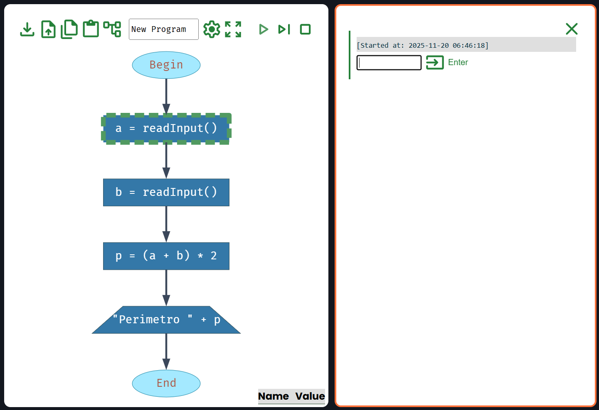

L'elenco completo di tutte le funzioni supportate è disponibile nella
[documentazione](https://flowrun.io/docs/reference/predefined-functions) di FlowRun.
