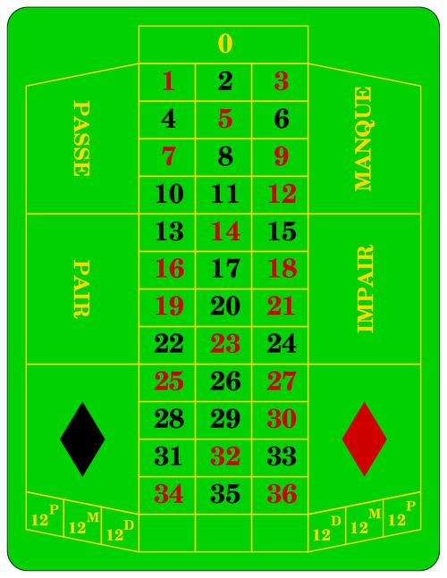

# Esempi di codice Python

Alcune esercizi con _Python_ spiegati.

1. TOC
{: toc }

Possiamo scrivere e verificare questi programmi su:

- [FARE](https://fare.polito.it/python), ambiente del Politecnico di Torino.
- [Online GDB](https://www.onlinegdb.com), ricordandoci di selezionare _Python 3_ da menù in alto a destra.

## Numeri primi

In questo esempio vogliamo calcolare e stampare dei numeri primi.
Definizione: un numero è primo se è divisibile solo per 1 e per sé stesso.

Per verificare se un numero `a` è divisibile per un numero `b`, usiamo
l'operatore _modulo_ (`%`) che calcola il resto della divisione di `a` per `b`.
Verifichiamo se `b` è divisore di `a` controllando se `a % b == 0`.

In generale, per un numero `n` se non si trova un divisore fra `2` e `n - 1`, allora `n` è primo.

Esistono algoritmi sicuramente più complessi e efficienti per verificare
se un numero è primo ma noi useremo questo algoritmo semplice. I numeri
primi sono fondamentali in matematica e informatica, in particolare per la crittografia:
c'è tanto tanto lavoro universitario e di centri di ricerca ma a noi _va bene così_.

Separiamo allora l'esercizio in 2 parti.

### Controllare se un numero è primo

Chiediamo all'utente un numero `n` e verifichiamo se è primo:

```python
n = int(input("Inserisci un numero"))

# Il numero è primo fino a prova contraria
is_prime = True

# Cerchiamo quindi le prove contrarie, cerchiamo cioè
# se esiste almeno un divisore fra 2 e n - 1.
for d in range(2, n): # range(2, n) esclude n
  if n % d == 0:      # se d è divisore di n
    is_prime = False  # allora n non è primo
    break             # Non è necessario, ma leggi sotto

# Stampiamo il risultato
if is_prime:
  print(n, "è primo")
else:
  print(n, "non è primo")
```

Il cuore dell'algoritmo, il ciclo `for`, ricerca i potenziali divisori `d`
nell'intervallo fra `2` e `n - 1`, usando `range(2, n)` che include
nell'intervallo il 2 ma non include l'_n_.

L'istruzione `break` serve per abbreviare il calcolo. Avendo trovato
un divisore, non ha senso continuare a cercare quindi `break` blocca
il ciclo `for` prima che questo si concluda. Non è essenziale farlo.

### Stampa dei numeri primi fino a 1000

Capito come si controlla se un numero è primo o meno, possiamo
usare il cuore dell'esempio precedente per stampare tutti i numeri
primi che si trovano fino a 1000. Non serve più chiedere all'utente niente.

```python
for n in range(2, 1000 + 1): # andiamo a cercare i numero fino a 1000 incluso
  is_prime = True
  for d in range(2, n): # range(2, n) esclude n
    if n % d == 0:
      is_prime = False
      break
  if is_prime:
    print(n)
```

Vediamo che il numero primo più grande prima di 1000 è **997**.

### Stampa dei primi 1000 numeri primi

Un'altra variante potrebbe essere quella di stampare
tutti i numeri primi finché non se ne trovino 1000.

Usiamo un `while` e contiamo quanti ne troviamo.
Non possiamo usare un `for` perché non sappiamo questi
1000 numeri quali sono e quindi fino a che numero cercare.

```python
found = 0 # qui contiamo quanti ne abbiamo trovati
n = 2     # partiamo da 2

# Andiamo alla ricerca fino a quando non ne troviamo 1000
while found < 1000:

  # Verifichiamo n
  is_prime = True
  for d in range(2, n): # range(2, n) esclude n
    if n % d == 0:
      is_prime = False
      break

  # n è primo, segnamocelo
  if is_prime:
    found = found + 1
    print(n)
  
  # Prossimo n
  n = n + 1
```

Ci mette un po' perché troveremo che il millesimo numero primo è **7919**.
Più un numero è grande e più ci mette a fare il controllo.

Vedete quanto ci mette e poi provate a vedere quanto ci mette senza `break`.
Vedrete che ci impiegherà _molto_ di più.

## Tavola pitagorica

_(in via di pubblicazione)_

## Roulette

Simuliamo il lancio della pallina della [roulette](https://it.wikipedia.org/wiki/Roulette):


Al casinò, nel gioco della roulette, il _[croupier](https://it.wikipedia.org/wiki/Croupier)_
lancia una pallina mentre la ruota è in movimento e pronuncia le frasi _Les jeux sont faits!_
e poi _Rien ne va plus!_ per dire i giochi e tutte le puntate sono finite: si aspetta il risultato.

La roulette è un gioco francese e le frasi ufficiali sono quindi tutte in francese.

Quando la pallina e la ruota si fermano, il _croupier_ annuncia il risultato descrivendo
le caratteristiche del numero uscito, ad esempio dicendo _27 : rouge, impair et passe_.
Può uscire un numero a caso da zero a 36.



Simuliamo il lancio della pallina della roulette in questo modo:

- Generiamo un numero a caso da 0 a 36.
- Dire se il numero uscito è zero oppure no.
- Se è uscito zero, non c'è altro da aggiungere.
- Se non è uscito zero:
  - Dire quale numero è uscito
  - Dire se il numero uscito è rosso (_rouge_) o nero (_noir_)
  - Dire se il numero uscito è pari (_pair_) o dispari (_impair_)
  - Dire se il numero uscito è minore o uguale a 18 (_manque_) o maggiore di 18 (_passe_)

I numeri rossi sono 1, 3, 5, 7, 9, 12, 14, 16, 18, 19, 21, 23, 25, 27, 30, 32, 34 e 36.
Gli altri sono neri. Lo zero è verde.

_Hint:_ per generare un numero casuale, seguire le istruzioni della documentazione di python:

```
random.randint(a, b)
Return a random integer N such that a <= N <= b. Alias for randrange(a, b+1).
```

Bisogna importare la funzione `randint` per poterla usare tramite `from random import randint`.

Prima possibile soluzione:

```Python
# Per poter usare la funzione randint dobbiamo "prenderla" (importarla) dal modulo random
from random import randint

print("Les jeux sont faits!")
print("Rien ne va plus!")

# Tiriamo la pallina, esce un numero
n = randint(0, 36)

if n == 0:
  print("Zero!")
else:
  # Stampa il numero
  print(n)
  
  # Stampa se rosso o nero
  if n in [1, 3, 5, 7, 9, 12, 14, 16, 18, 19, 21, 23, 25, 27, 30, 32, 34, 36]:
    print("Rouge")
  else:
    print("Noir")
    
  # Stampa se pari o dispari
  if n % 2 == 0:
    print("Pair")
  else:
    print("Impair")  
 
  # Stampa se maggiore o minore di 18
  if n <= 18:
    print("Manque")
  else:
    print("Passe")
```

Una versione migliore, che separa il calcolo dalla stampa dei messaggi:

```python
# Per poter usare la funzione randint dobbiamo "prenderla" (importarla) dal modulo random
from random import randint

print("Les jeux sont faits!")
print("Rien ne va plus!")

# Qui calcoliamo tutto
n = randint(0, 36)
is_zero = n == 0
is_red = n in [1, 3, 5, 7, 9, 12, 14, 16, 18, 19, 21, 23, 25, 27, 30, 32, 34, 36]
is_even = n % 2 == 0
is_low = n <= 18

# Qui stampiamo senza fare alcun calcolo
if is_zero:
  print("Zero!")
else:
  # Stampa il numero
  print(n)
  
  # Stampa se rosso o nero
  if is_red:
    print("Rouge")
  else:
    print("Noir")

  # Stampa se pari o dispari
  if is_even:
    print("Pair")
  else:
    print("Impair")
  
  # Stampa se maggiore o minore di 18
  if is_low:
    print("Manque")
  else:
    print("Passe")
```

Abbiamo introdotto delle variabili booleane che iniziano, per convenzione,
con `is_` e indicano una proprietà che può essere vera (`True`) o falsa (`False`):

- `is_zero` per indicare se il numero uscito è zero
- `is_red` per indicare se è rosso
- `is_even` per indicare se è pari
- `is_low` per indicare se è minore o uguale a 18

{: .highlight }
Avendo separato il calcolo dalla stampa, possiamo riscrivere la parte che stampa i messaggi
tante volte senza doverci preoccupare di cambiare come il risultato viene calcolato.
_Separare 2 funzionalità in 2 pezzi di codice distinti_ è sempre un bene.

Stessa versione ancora più elegante, facendo uso della sistassi compatta (tecnica avanzata!) `x if condizione else y`:

```python
# Per poter usare la funzione randint dobbiamo "prenderla" (importarla) dal modulo random
from random import randint

print("Les jeux sont faits!")
print("Rien ne va plus!")

# Qui calcoliamo tutto
n = randint(0, 36)
is_zero = n == 0
is_red = n in [1, 3, 5, 7, 9, 12, 14, 16, 18, 19, 21, 23, 25, 27, 30, 32, 34, 36]
is_even = n % 2 == 0
is_low = n <= 18

# Qui stampiamo senza fare alcun calcolo
if is_zero:
  print("Zero!")
else:
  # Stampa il numero
  print(n)
  
  # Stampa se rosso o nero
  print("Rouge" if is_red else "Noir")

  # Stampa se pari o dispari
  print("Pair" if is_even else "Impair")
    
  # Stampa se maggiore o minore di 18
  print("Manque" if is_low else "Passe")
```

Finale ancora migliore, formattiamo meglio tutto in un'unica frase:

```python
# Per poter usare la funzione randint dobbiamo "prenderla" (importarla) dal modulo random
from random import randint

print("Les jeux sont faits!")
print("Rien ne va plus!")

# Qui calcoliamo tutto
n = randint(0, 36)
is_zero = n == 0
is_red = n in [1, 3, 5, 7, 9, 12, 14, 16, 18, 19, 21, 23, 25, 27, 30, 32, 34, 36]
is_even = n % 2 == 0
is_low = n <= 18

# Qui stampiamo senza fare alcun calcolo
if is_zero:
  print("Zero!")
else:
  # Stampa la frase che annuncia il numero
  print(n,
    ":",
    "rouge," if is_red else "noir,",
    "pair" if is_even else "impair",
    "et",
    "manque" if is_low else "passe")
```
