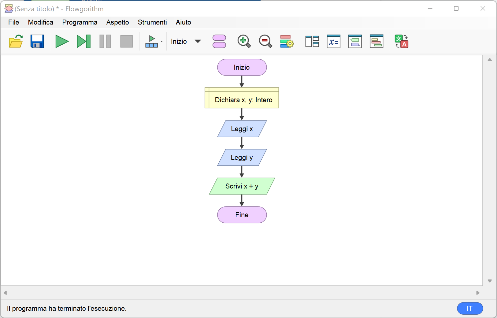
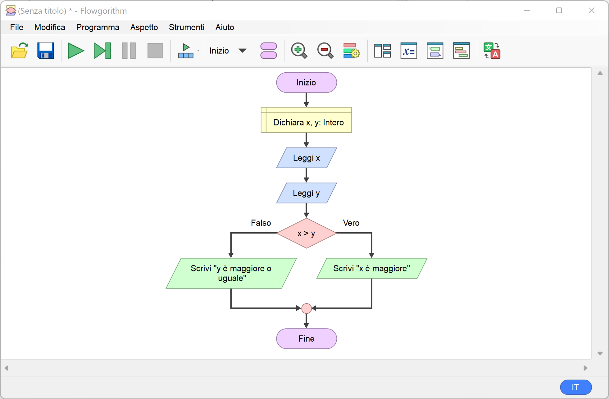
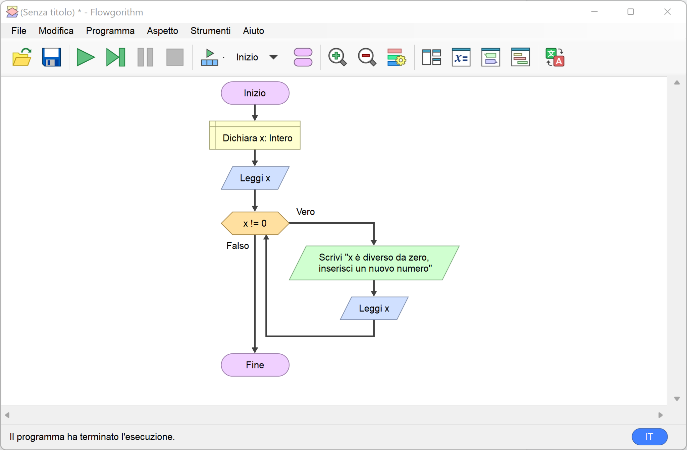
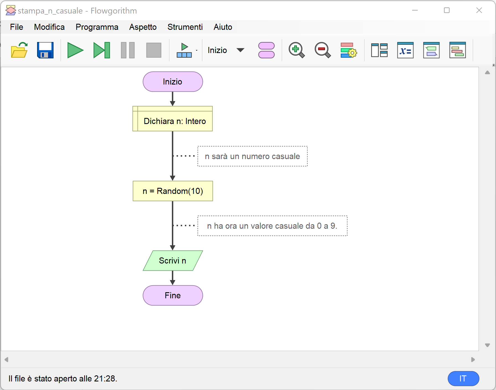

# Esempi con Flowgorithm e _python_

Ecco alcuni esempi di semplici algoritmi e programmi con _Flowgorithm_ e loro equivalenti in _python_.

1. TOC
{: toc }

## Somma di due numeri

Chiede all'utente due numeri e stampa la loro somma.



Codice equivalente in _python_:

```python
x = int(input())
y = int(input())
print(x + y)
```

## Quale di due numeri è il maggiore?

Chiede all'utente due numeri e indica quale è il maggiore.



Codice equivalente in _python_:

```python
x = int(input())
y = int(input())
if x > y:
  print("x è maggiore")
else:
  print("y è maggiore o uguale")
```

## Ripeti finché non si inserisce zero

Chiedi a ripetizione un numero all'utente fino a quando questo non inserisce zero.



Codice equivalente in _python_:

```python
x = int(input())
while x != 0:
  print("x è diverso da zero, inserisci un nuovo numero")
  x = int(input())
```

## Stampa un numero casuale tra 0 e 9

Ogni volta che il programma viene eseguito stampa un numero diverso.



Codice equivalente in _python_:

```python
from random import randint

n = randint(0, 9)
print(n)
```

## Scrivi i numeri da 1 a 100

Scrive con una ripetizione tutti i numeri da 1 a 100.

[Diagramma](scrivi_100_numeri.fprg){: .btn }

Codice equivalente in _python_:

```python
n = 1
while n <= 100:
  print(n)
  n = n + 1
```

## Inserisci un numero maggiore di 10

Chiede un numero all'utente e continua a chiederlo fino a quando
non viene inserito un numero maggiore di 10.

[Diagramma](inserisci_maggiore_di_10.fprg){: .btn }

Codice equivalente in _python_:

```python
print("Inserisci un numero maggiore di 10")
n = int(input())
while n <= 10:
  print("Sbagliato, riprova")
  n = int(input())
```

## Cosa puoi guidare a quale età?

Data l'età dell'utente, scrive quali mezzi di trasporto può guidare.

[Diagramma](cosa_puoi_guidare.fprg){: .btn }

Codice equivalente in _python_:

```python
print("Quanti anni hai?")
eta = int(input())
if eta >= 18:
  print("Puoi guidare una macchina")
else if eta >= 14:
  print("Puoi guidare un motorino")
else if eta >= 4:
  print("Puoi andare in bicicletta")
else:
  print("Puoi camminare")
```

Esiste una versione più corretta dove viene stampato
tutto quello che una persona può guidare a una certa età, non solo
il mezzo di trasporto più grande come nell'esempio precedente.

[Diagramma](cosa_puoi_guidare_2.fprg.fprg){: .btn }

Codice equivalente in _python_:

```python
print("Quanti anni hai?")
eta = int(input())
if eta >= 18:
  print("Puoi guidare una macchina")
if eta >= 14:
  print("Puoi guidare un motorino")
if eta >= 4:
  print("Puoi andare in bicicletta")
print("Puoi camminare")
```

## Massimo di alcuni numeri

Chiede alcuni numeri e stampa il massimo fra di essi.

[Diagramma](massimo.fprg){: .btn }

Il programma non può essere convertito in _python_ in quanto
fa uso del blocco _Fai_. Come [spiegato](../codice/index.md#fai-do--while) non esiste in _python_
un modo per scrivere questo blocco. È necessario prima modificare
il programma _Flowgorithm_ per sostituire _Fai_ con _Mentre_,
e successivamente trasformare il programma in _python_.

Questo è lasciato come esercizio.
