# Programmare in python con Colab

Viene ora introdotto _python_ come linguaggio di programmazione,
Google Colab come ambiente dove poter programmare in _python_,
e semplici regole per convertire programmi _Flowgorithm_ in _python_.

1. TOC
{: toc }

## Introduzione

_python_ è uno fra i più diffusi linguaggi di programmazione, se non il più diffuso.
È un linguaggio facile da imparare ed è utilizzabile in moltissimi campi: applicazioni
per computer e smartphone, analisi dati, intelligenza artificiale, siti web,
dispositivi connessi a internet, …

La probabilità di incontrare _python_ in un posto di lavoro è molto alta,
anche in caso di lavori non direttamente legati all'informatica.

Cercare su YouTube "introduzione a python".

## Installazione e primo utilizzo

_python_ può essere installato in vari modi, in funzione del tipo di computer e sistema operativo.
Per maggiori informazioni, consultare il sito ufficiale [python.it](https://www.python.it).

In questo corso **non** installeremo _python_ sul computer, ma utilizzeremo un servizio offerto
da Google per lavorare direttamente con _python_ (e non solo) senza dover installare nulla.
L'utilizzo di questo servizio è il modo più semplice per cominciare a lavorare con _python_.
In aggiunta, il servizio consente di capire cosa sia un notebook e come funzionino
le celle dei notebook che contengono codice _python_: questi argomenti sono importanti
e utilizzati in molte applicazioni di analisi dati, conoscerli non fa male.

Aprire quindi il sito Google Colab all'indirizzo [colab.research.google.com](https://colab.research.google.com)
e fare login con il proprio account Google se necessario.

## Come utilizzare Colab

Colab è un ambiente di Google dove è possibile definire dei notebook, dei blocchi note,
che possono contenere sia del testo che del codice. Codice e testo è contenuto in celle.
Il testo può essere formattato in grassetto, corsivo, e altri stili come per un normale documento.
Il codice invece viene eseguito dal sistema, e il risultato stampato sotto.

Questo modo di lavorare, scrivere cioè documenti che contengono codice che calcola qualcosa
(ad esempio un grafico o altro) all'interno del documento stesso è molto diffuso e
viene spesso usato in applicazioni di analisi dei dati.

Useremo un notebook come ambiente per scrivere semplici programmi _python_,
spesso derivanti da programmi Flowgorithm già conosciuti.

I notebook vengono salvati nella propria cartella Google Drive.
Aprire quindi [Colab](https://colab.research.google.com),
selezionare "New notebook" o selezionare un notebook già esistente.

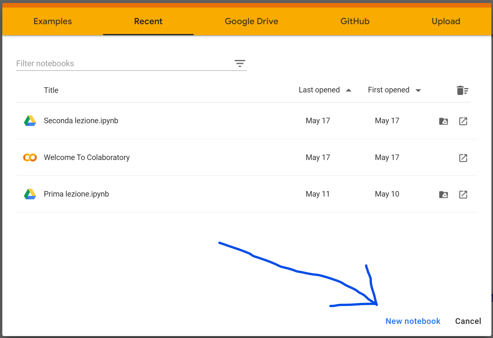

Appare quindi un notebook nuovo, che contiene una cella di codice vuota:

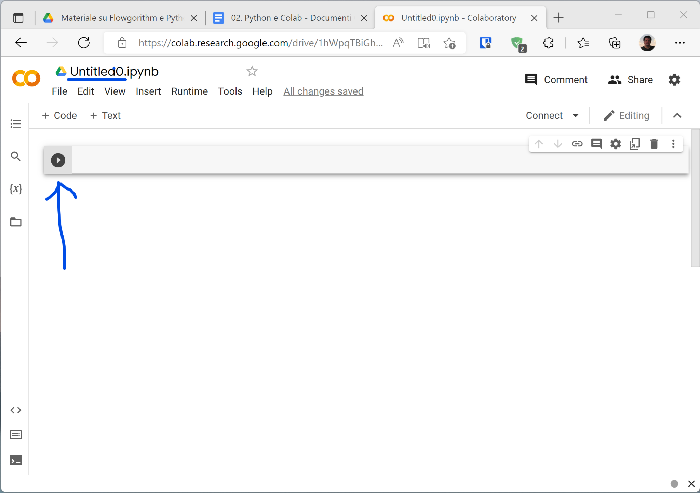

Il file si chiamerà probabilmente _Untitled0.ipynb_. È possibile e consigliabile
rinominarlo a piacere, ma è importante **non modificare** il suffisso _.ipynb_ per farlo funzionare.

La cella di codice è quella con il pulsante play. Premendolo, il codice viene avviato
e il risultato stampato sotto. Nell'esempio la cella è vuota e quindi non ci sarà alcun risultato.

Aggiungere il codice:

```python
print("Hello World")
```

alla cella, premere play, e vedere il risultato:

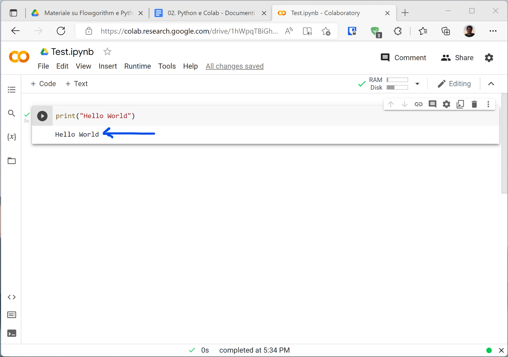

La cella stamperà il testo `Hello World`, perchè questo è quello che il nostro programma
ha richiesto tramite l'istruzione `print`. È possibile aggiungere ulteriori celle premendo
i pulsanti `+ Code` oppure `+ Text`, se si tratta di celle con codice oppure testuali.

## Scrivere codice python partendo da Flowgorithm

Vediamo ora come convertire i blocchi Flowgorithm in istruzioni _python_. Un algoritmo in
Flowgorithm può essere riscritto in _python_ semplicemente traducendo blocco per blocco.
Con un minimo di manualità, sarà poi possibile scrivere codice direttamente in _python_
senza dover prima definire il diagramma Flowgorithm.

### Dichiarazione

Il blocco _Dichiarazione_ non è necessario in _python_ e deve essere omesso.

### Lettura e Scrittura

I blocchi _Lettura_ e _Scrittura_ chiedono all’utente (lettura) o comunicano all’utente
(scrittura) il valore di una variabile. In _python_, la lettura è effettuata
dall'istruzione `input`, che legge una stringa. Se ci si aspetta un intero,
la stringa deve essere convertita in intero manualmente tramite l'istruzione `int`.

#### Leggere una variabile di tipo stringa

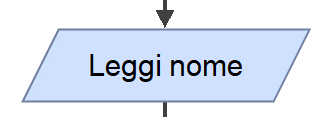

equivale in _python_ a:

```python
nome = input()
```

Le parentesi aperte e chiuse senza nulla al loro interno sono necessarie per l'istruzione `input`. 

#### Leggere una variabile di tipo intero


equivale in _python_ a:

```python
n = int(input())
```

L'istruzione `int` richiede invece parentesi aperte e chiuse con al loro interno cosa convertire
a intero, cioè `input()` compreso delle sue parentesi, e si intende quello che `input` ha letto.
Per questo, nel caso di lettura di interi, le parentesi sono doppie.

#### Leggere una variabile di tipo reale (numero decimale)

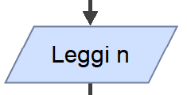

equivale in _python_ a:

```python
n = float(input())
```

L'istruzione `int` è sostituita da `float` in caso di numero reali, cioè numeri con la virgola.
La virgola dovrà però essere sostituita dal punto (`3.14` invece che `3,14`) quando questa
viene digitata, in quanto _python_ segue il sistema anglosassone in cui si usa il punto.

#### Scrivere una variabile
 
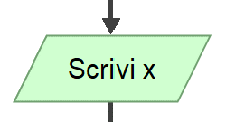

equivale in _python_ a:

```python
print(x)
```

`x` può essere una variabile di qualsiasi tipo, intero, reale, stringa o altro.
Anche in questo caso le parentesi dell'istruzione `print` indicano al loro interno
cosa deve essere stampato e sono necessarie.

#### Scrivere un'espressione

L'istruzione `print` accetta all'interno delle parentesi espressioni anche più complesse.

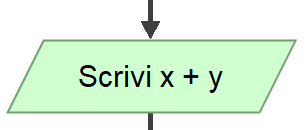

equivale in _python_ a:

```python
print(x + y)
```

#### Scrivere un messaggio composto

Immaginiamo di avere una vincita di 50 € a un gioco memorizzata nella variabile `vincita`.
Vogliamo scrivere il messaggio "Hai vinto 50 euro", usando la variabile `vincita`
invece di scrivere `50` direttamente nel testo del messaggio.

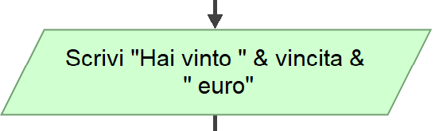

equivale in _python_ a:

```python
print("Hai vinto ", vincita, " euro")
```

Gli spazi nel testo virgolettato sono necessari altrimenti `50` appare attaccato
a `vinto` oppure `euro`. Le virgole separano i 3 testi o variabili da stampare,
il tutto all'interno delle parentesi della funzione `print`.
È possibile stampare 2, 3, 4 o più componenti, tutti separati da virgole.

### Assegnazione (`x = …`)

L’_Assegnazione_ imposta una variabile a un determinato valore, cioè assegna
quel valore alla variabile. Se la variabile non esiste, viene dichiarata all'istante:
per questo non è necessario in _python_ dichiarare le variabili e per questo il blocco
_Dichiarazione_ di Flowgorithm non ha un corrispettivo in _python_.

Le assegnazioni sono scritte direttamente in _python_ e il loro codice corrisponde
a quello nei diagrammi a blocchi, senza dover usare nessuna istruzione particolare.

Le assegnazioni utilizzano l'uguale singolo `=`.

#### Assegnare una costante intera

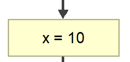

equivale in _python_ a:

```python
x = 10
```

#### Assegnare una costante stringa

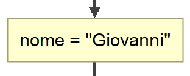

equivale in _python_ a:

```python
nome = "Giovanni"
```

#### Assegnare il valore calcolato da un'espressione

Assumendo le variabili `x` e `y` già definite e contenenti dei numeri (interi o reali):

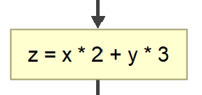

equivale in _python_ a:

```python
z = x * 2 + y * 3
```

### Condizione (`if … else …`)

Valuta una condizione, cioè un'espressione o una domanda che può avere solo risposta _vero_ o _falso_.
In caso _vero_, il programma esegue le istruzioni della parte `if`. In caso _falso_, il programma
esegue le istruzioni della parte `else`, che può anche essere omessa se non c'è alcuna istruzione
da eseguire. Al termine, il programma continua dritto.

In _python_, a volte come in questo caso il codice deve essere scritto indentato,
cioè incolonnato verso destra, rispetto a una istruzione principale. È il caso di `if` e `else`.

#### Condizione semplice

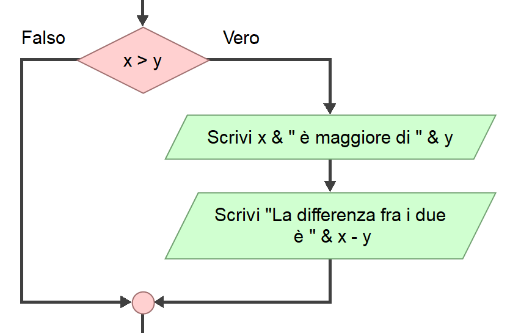

equivale in _python_ a:

```python
if x > y:
  print(x, " è maggiore di ", y)
  print("La differenza fra i due è ", x - y)
```

Notare il due-punti a concludere la riga con `if`. Le istruzioni del ramo _vero_,
cioè quando effettivamente `x` è maggiore di `y`, vengono riportate indentate,
cioè incolonnate verso destra di 2 spazi rispetto alla riga dell'`if`.
In questo modo _python_ è in grado di riconoscere quali istruzioni fanno parte del ramo _vero_
dell'`if` e quali no.

Gli spazi dell'indentazione sono necessari e devono essere uguali per tutte le istruzioni
contenute nel ramo. Non mettere gli spazi o mettere spazi non uguali è considerato un errore.

#### Condizione con ramo else

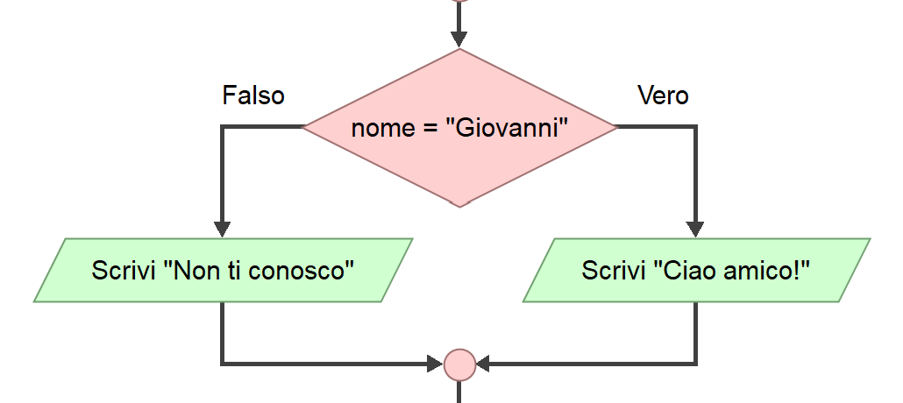

equivale in _python_ a:

```python
if nome == "Giovanni":
  print("Ciao amico!")
else:
  print("Non ti conosco")
```

In questo caso vediamo la presenza del ramo `else`, cioè il ramo che viene eseguito quando
la condizione dell'`if` è _falsa_. Notare l'indentazione di entrambe le istruzioni `print`:
l'indentazione è necessaria.

### Come scrivere le condizioni

Le condizioni sono molto simili a quelle Flowgorithm e possono essere scritte con gli operatori:
- `==` uguale (attenzione, deve essere un doppio uguale)
- `!=` diverso
- `>` maggiore, `>=` maggiore o uguale
- `<` minore, `<=` minore o uguale

Le condizioni possono essere composte insieme tramite operazioni E (`and`) e O (`or`).

Alcuni esempi per comprendere meglio:

- `a > b and c < d`, vera se `a` è maggiore di `b` E `c` è minore di `d`,
  cioè se sia la prima che la seconda condizione sono vere. Entrambe devono essere vere.
- `nome == "Carlo" or a == b`, vera se `nome` è _Carlo_ O `a` è uguale a `b`,
  cioè se la prima condizione oppure la seconda condizione (o entrambe) sono vere.
  Almeno una deve essere vera.
- `a > b and b > c and c > d`, tutte e 3 le condizioni devono essere vere.
- `(a > b and b > c) or a == c`, sia la prima che la seconda condizione deve essere vera,
  oppure la terza condizione deve essere vera.

### Mentre (`while …`)

Così come il blocco _Condizione_ visto precedentemente, il blocco _Mentre_ introduce
una condizione che deve essere scritta in forma di espressione _vero_ o _falso_.

In _python_, in blocco è espresso dall'istruzione `while`. Così come `if`, `while` richiede
una condizione e una o più istruzioni indentate, che vengono eseguite a ripetizione fino
a quando la condizione è _vera_.

Le condizioni vengono scritte esattamente come le condizioni per l'istruzione `if` (vedi sopra).

#### Ripetizione di esempio

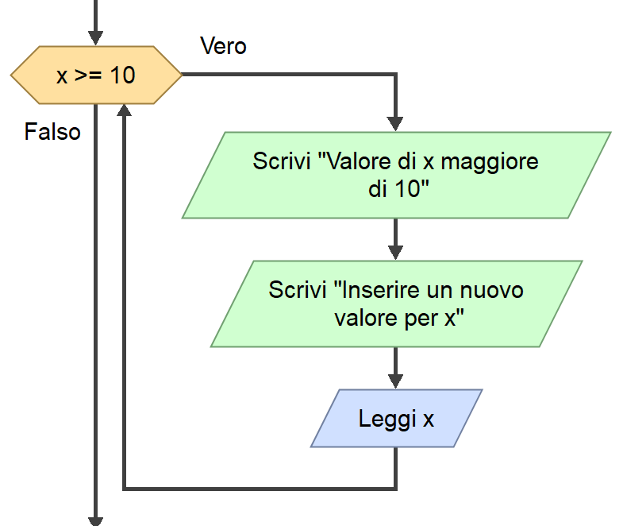

equivale in _python_ a:

```python
while x >= 10:
  print("Valore di x maggiore di 10")
  print("Inserire un nuovo valore per x")
  x = int(input())
```

### Fai (`do … while`)

Non esiste codice equivalente per questo blocco in _python_.

L'algoritmo deve essere modificato per esprimerlo attraverso un blocco `while` e non `do … while`,
e successivamente riscritto in _python_ come spiegato sopra.

### Indentazione multipla

È possibile inserire istruzioni `if` dentro `while`, `if` dentro `if`, `while` dentro `while`, ecc…
_python_ non pone limiti a quanto il codice può essere indentato, l'importante è che l'indentazione
sia ben ordinata e corrisponda alla logica che si vuole implementare.

Se ad esempio ogni blocco è indentato di 2 spazi, il primo livello deve essere indentato di 2 spazi, il secondo di 4, il terzo di 6, …

L'indentazione è importantissima in _python_ in quanto ha effetto su come il programma si comporta.
Sbagliare l'indentazione produce degli errori o un comportamento non corretto del programma.

Questo esempio mostra 3 livelli di indentazione:

```python
x = int(input())

while x >= 0:
  print("x è positivo")
  if x > 10:
    print("x è maggiore di 10")
  else:
    print("x è minore o uguale a 10")
    if x < 5:
      print("x è anche minore di 5")
  x = int(input())

print("Fine dell'esercizio")
```

## Funzioni

_python_ contiene migliaia di funzioni e può essere esteso attraverso migliaia librerie esterne,
che a loro volta contengono spesso altre migliaia di funzioni. È un universo in rapida espansione.
Esiste una libreria e una funzione per ogni cosa, dall'accesso a internet all'analisi dati
dall'intelligenza artificiale al disegno 3D e ai videogiochi.

Ecco l'equivalente _python_ di alcune funzioni di Flowgorithm:
- `randint(a, b)` - un numero casuale tra `a` e `b`.
- `len(s)` - la lunghezza della stringa `s`, ovvero di quanti caratteri è composta.
- `abs(n)` - il valore assoluto di `n`.
- `int(n)` - la parte intera di `n`, cioè `n` senza le sue cifre decimali.
- `sqrt(n)` - la radice quadrata di `n`.

Attenzione:
- per utilizzare `randint`, è necessario scrivere a inizio notebook l'istruzione:
  `from random import randint`
- per utilizzare `sqrt`, è necessario scrivere a inizio notebook l'istruzione:
  `from math import sqrt`

_python_ è ben documentato: l’elenco completo di tutti i moduli (`from … import …`) e di tutte
le funzioni di ogni modulo è disponibile nella sconfinata
[documentazione online](https://docs.python.org/3). Oppure cercare con Google la funzione
che serve di volta in volta, facendo attenzione a specificare "python" nella ricerca,
ad esempio "lunghezza di una stringa in python".
