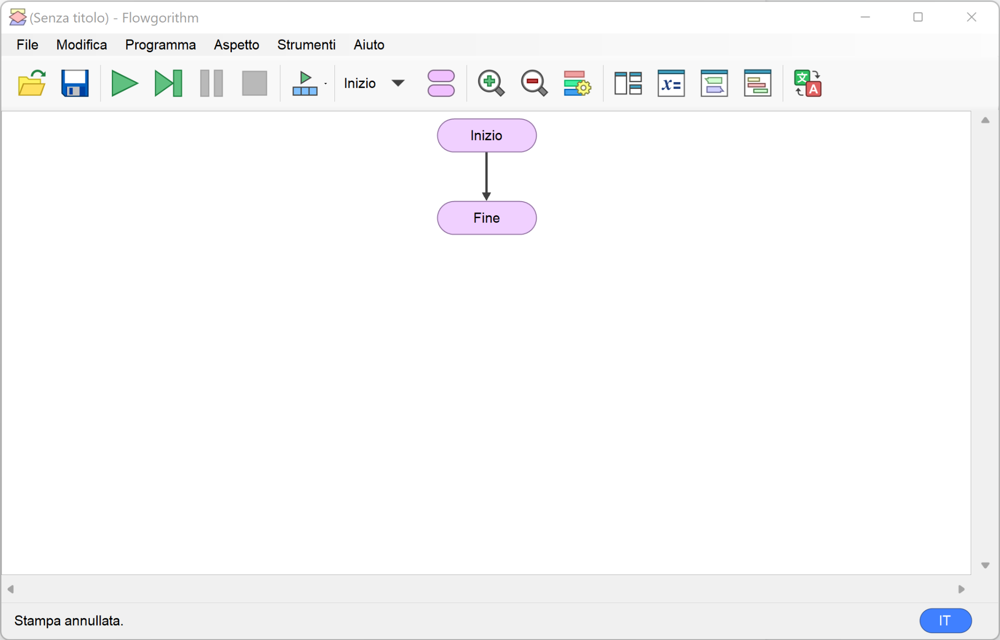
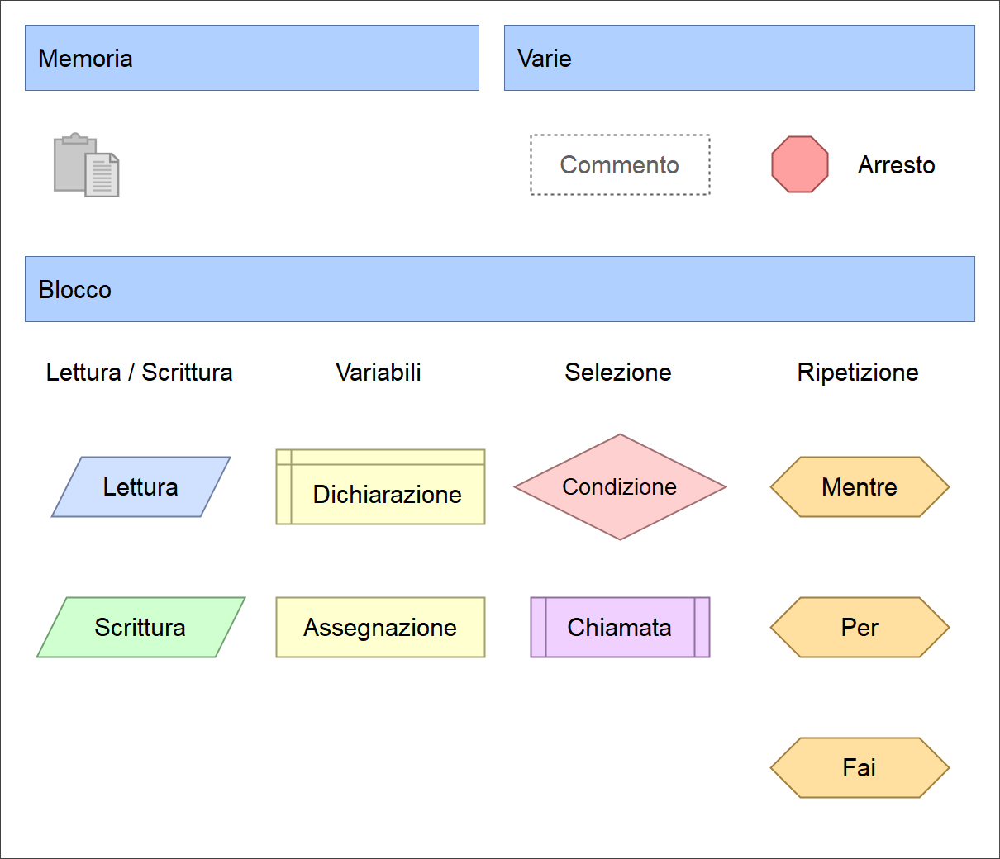
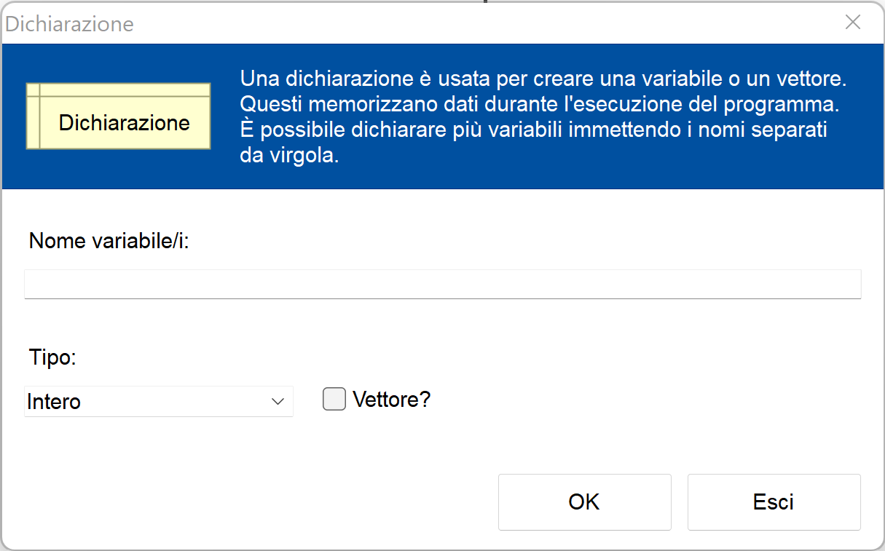
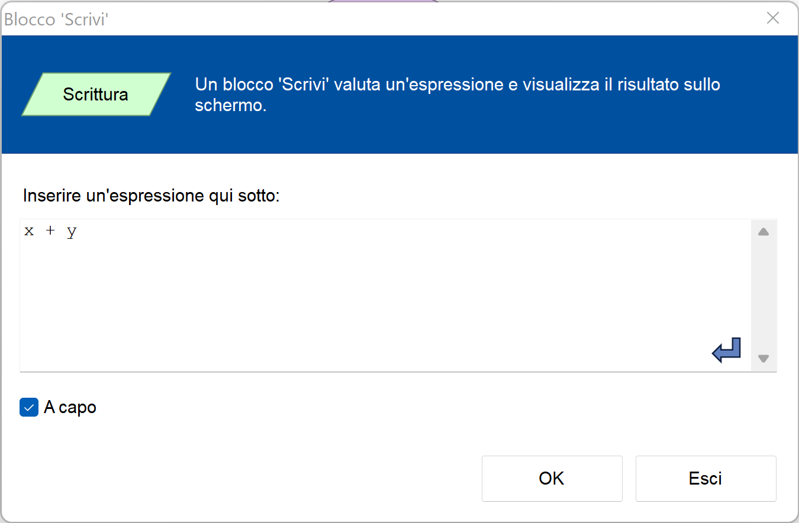
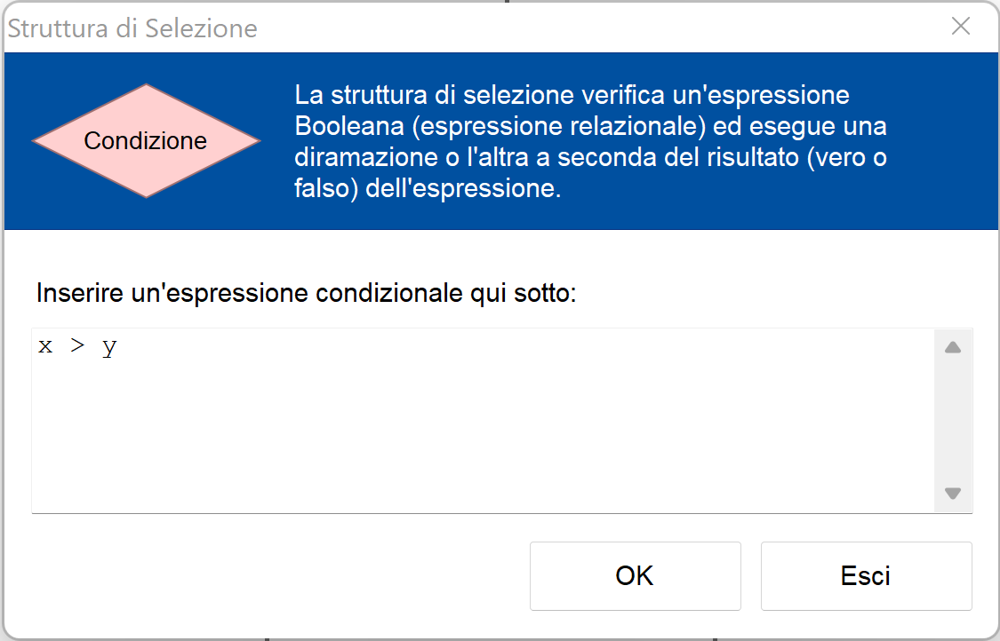
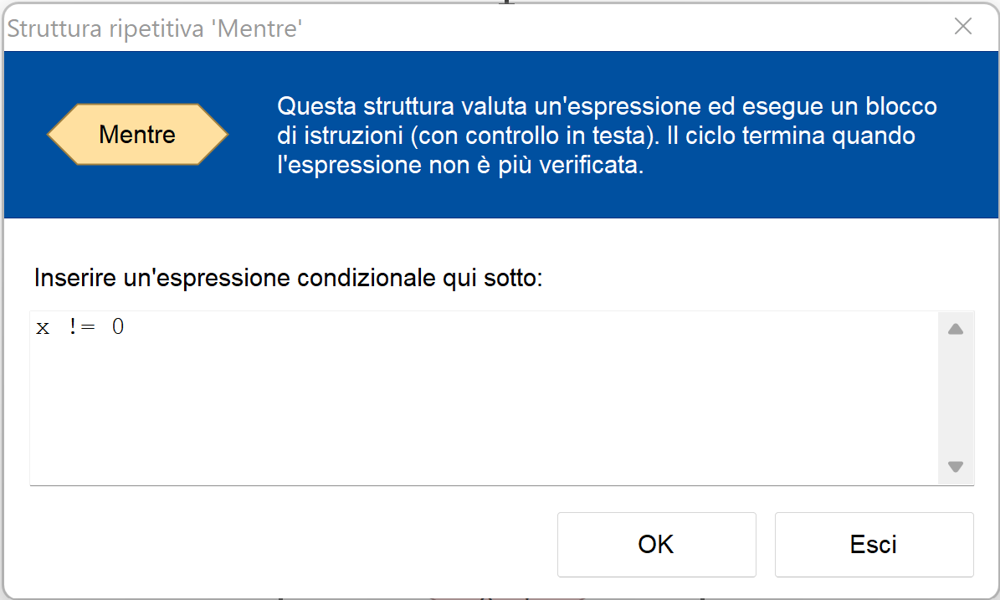

# Diagrammi di flusso con Flowgorithm

Breve guida per installare, capire e utilizzare Flowgorithm
e scrivere semplici algoritmi e programmi tramite diagrammi di flusso.

1. TOC
{: toc }

## Installazione

Per installare Flowgorithm, seguire le istruzioni sul sito ufficiale
[flowgorithm.org](http://flowgorithm.org/). Il programma è disponibile per Windows,
ma con fatica può essere usato anche su Mac e Linux seguendo le istruzioni sul sito.

[Scarica Flowgorithm](http://flowgorithm.org/download/index.html){: .btn }

## Utilizzo

Aprire Flowgorithm cercandone l'icona sul desktop o nel menù _Start_.
Creare un nuovo progetto. Apparirà questa schermata:

Selezionare una freccia, ad esempio all’inizio l’unica presente
fra _Inizio_ e _Fine_, e selezionare quale blocco inserire fra quelli proposti dal programma:

## Come e quali blocchi utilizzare

Flowgorithm differisce dagli schemi spesso fatti alla lavagna in quanto necessita
di una dichiarazione esplicita delle variabili usate (blocco _Dichiarazione_)
e dal fatto che non permette alle frecce di essere disegnate
e connessa a piacere con i blocchi.

### Dichiarazione

Il blocco _Dichiarazione_ introduce nel programma una o più variabili,
che possono avere un nome a piacere (senza spazi) come ad esempio, `x`, `y`, `z`,
`nome`, `numero`, `base`, `altezza` o qualunque altro nome.

Nel campo _Nome variabile/i_ inserire il nome della variabile che si vuole introdurre
nel programma, oppure più di un nome, separati da virgole.

Ogni variabile ha un tipo, concetto comune in molti linguaggi di programmazione.
Il programmatore deve dire che tipo di dati verrà memorizzato nelle variabili dichiarate.

Possibili tipi:
- Intero: numeri come `0`, `1`, `2`, `3`, …, `-4`, `-5`, … 
- Reale: numeri con la virgola come `0`, `1.5`, `3.14`, `-2.79`, …
- Stringa: del testo come `"Roma"`, `"Italia"`, `"lunedì"`, `"Giovanni"`, `"casa"`, `"scuola"`, …
- Booleano: può assumere solo il valore vero o falso.

Attenzione: la virgola decimale è sostituita dal punto `.` secondo la convenzione anglosassone.
Le stringhe, cioè il testo, devono sempre essere incluse fra virgolette `"…"`.

### Lettura e Scrittura

I blocchi _Lettura_ e _Scrittura_ chiedono all’utente (lettura) o comunicano
all’utente (scrittura) il valore di una variabile.

Durante la lettura, l’utente inserisce un valore e questo viene assegnato alla variabile,
eliminando l’eventuale valore precedente memorizzato in precedenza.
Nell’esempio viene letta la variabile nome.

Durante la scrittura, il valore della variabile viene comunicato all’utente,
lasciando la variabile inalterata. È un errore scrivere una variabile se a questa
non è stato ancora assegnato un valore. Nell’esempio viene scritta la variabile `x`.

È anche possibile scrivere un’espressione, intesa come valore composto da una
o più variabili, ad esempio `x + y`. Il programma scriverà la somma delle due variabili.

Nelle espressioni è possibile utilizzare le operazioni:
- `+` addizione
- `-` sottrazione
- `*` moltiplicazione
- `/` divisione
- `%` resto della devisione, detto _modulo_

È possibile anche usare le parentesi tonde `(` e `)` come nelle espressioni matematiche.

### Assegnazione (`x = …`)

L’_Assegnazione_ imposta una variabile a un determinato valore, cioè assegna
quel valore alla variabile. Abbiamo visto che questo è possibile tramite il blocco
_Lettura_, tramite cui alla variabile viene assegnato un valore dato dall’utente.
Con il blocco _Assegnazione_ invece il valore viene calcolato dal programma.

L’assegnazione può essere usata per assegnare a una variabile un valore iniziale,
tipicamente zero, oppure un valore calcolato come nell’esempio
illustrato in figura, dove `z = x + y`.

È possibile usare qualunque espressione, anche complessa, in un'assegnazione.

### Condizione (`if … else …`)

Valuta una condizione, cioè un'espressione o una domanda che può avere
solo risposta _vero_ o _falso_. In caso _vero_, il programma prosegue con i blocchi
sulla destra. In caso _falso_, il programma prosegue con i blocchi sulla sinistra.
Al termine il programma continua dritto.

L’espressione ha tipicamente una forma che può avere solo risposta _vero_ o _falso_,
ad esempio `x > 0`, `x > y`, `x == y`, `nazione == "Italia"`, …

Non sono espressioni valide: `x + y`, `x - 5`, … in quanto la loro risposta
non può essere solo _vero_ o _falso_.

Le condizioni possono essere scritte con gli operatori:
- `==` uguale
- `!=` diverso
- `>` maggiore, `>=` maggiore o uguale
- `<` minore, `<=` minore o uguale

Le condizioni possono essere composte insieme tramite operazioni E (`&&`) e O (`||`).

Alcuni esempi per comprendere meglio:
- `a > b && c < d`, vera se `a` è maggiore di `b` E `c` è minore di `d`,
  cioè se sia la prima che la seconda condizione sono vere. Entrambe devono essere vere (E).
- `nome == "Carlo" || a == b`, vera se `nome` è Carlo O `a` è uguale a `b`,
   cioè se la prima condizione oppure la seconda condizione (o entrambe) sono vere (O).
   Almeno una deve essere vera.
- `a > b && b > c && c > d`, tutte e 3 le condizioni devono essere vere.
- `(a > b && b > c) || a == c`, sia la prima che la seconda condizione deve essere vera (E),
  oppure la terza condizione deve essere vera (O).

### Mentre (`while …`)

Per comprendere meglio questo blocco, immaginare si chiami _Finché_, che è una traduzione
in italiano di _Mentre_ più adatta a rappresentare il comportamento del blocco.

Così come il blocco _Condizione_ visto precedentemente, il blocco _Mentre_ introduce
una condizione che deve essere scritta in forma di espressione _vero_ o _falso_,
nell’esempio riportato si chiede se `x` sia diverso da zero.

Ricordarsi che `!=` significa _diverso da_.

Il blocco introduce una ripetizione (loop). I blocchi sulla destra vengono ripetuti
finché la condizione è _vera_. La condizione viene valutata all’inizio di ogni ripetizione.
Tutto questo si ripete fino a quando la condizione rimane _vera_, cioè finché `x` è diverso da zero.

Quando la condizione diventa _falsa_, il ciclo si interrompe e il programma continua
dopo il ciclo. Se la condizione è _falsa_ fin dall’inizio, i blocchi sulla destra
non vengono eseguiti neanche una volta.

### Fai (`do … while`)

Per comprendere meglio questo blocco, immaginare si chiami _Fai … Finché …_,
che è un nome più adatto di solo _Fai_ a rappresentare il comportamento del blocco.

Così come il blocco _Condizione_ visto precedentemente, il blocco _Fai_ introduce
una condizione che deve essere scritta in forma di espressione _vero_ o _falso_,
nell’esempio riportato si chiede se `x` sia maggiore o uguale a 5.

Il blocco introduce una ripetizione (loop). I blocchi sulla destra vengono ripetuti
finché la condizione è _vera_. La condizione viene valutata alla fine di ogni ripetizione.
Tutto questo si ripete fino a quando la condizione rimane _vera_.

Quando la condizione diventa _falsa_, il ciclo si interrompe e il programma continua
dopo il ciclo. I blocchi sulla destra vengono eseguiti almeno una volta,
anche se la condizione è _falsa_ fin dall’inizio: questa è la differenza fondamentale tra
_Fai_ e _Mentre_. In questo caso il contenuto del blocco viene eseguito almeno una volta.
Nel caso di _Mentre_, è possibile che il contenuto non venga mai eseguito.

## Funzioni

Flowgorithm riconosce alcune funzioni che possono essere usate nelle assegnazioni
di variabili e nelle espressioni condizionali.

Alcuni esempi:
- `Random(n)` - un numero casuale tra `0` e `n - 1`.
- `Len(s)` - la lunghezza della stringa `s`, ovvero di quanti caratteri è composta.
- `Abs(n)` - il valore assoluto di `n`.
- `Int(n)` - la parte intera di `n`, cioè `n` senza le sue cifre decimali.
- `Sqrt(n)` - la radice quadrata di `n`.

L’elenco completo di tutte le funzioni supportate è disponibile
[online](http://www.flowgorithm.org/documentation/intrinsic-functions.html).
