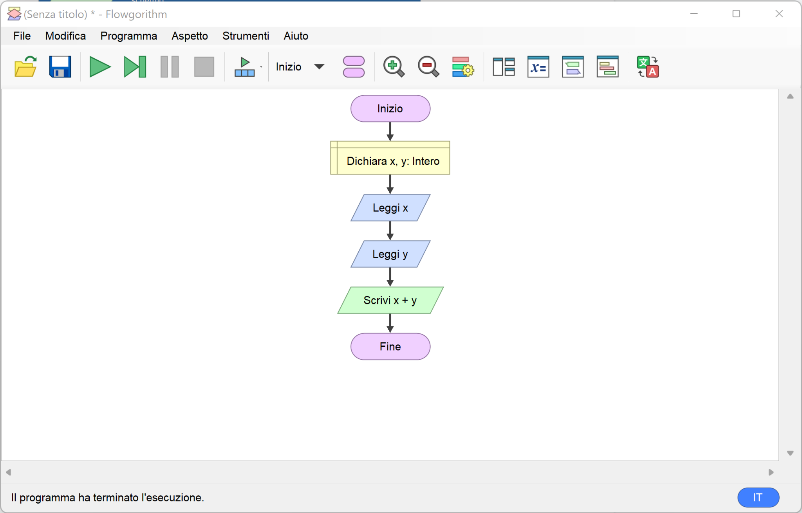
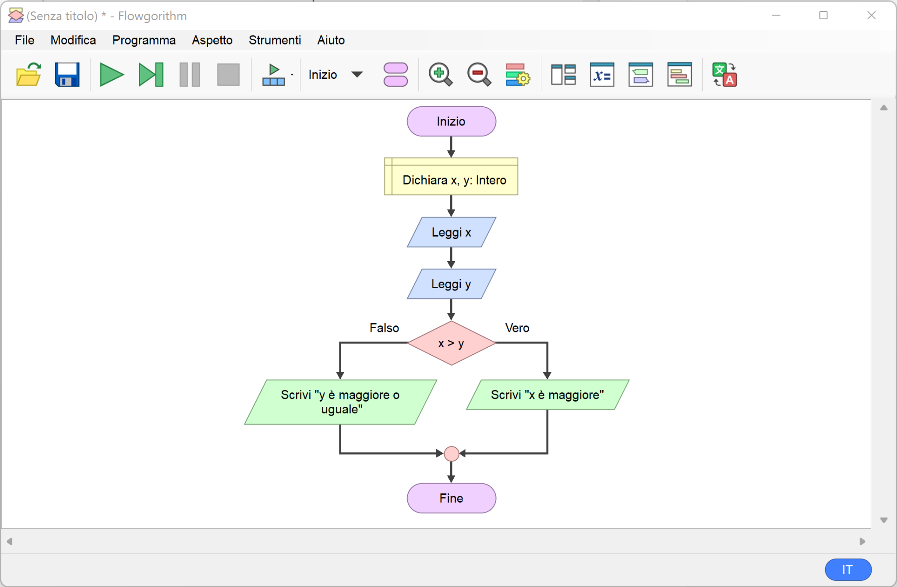
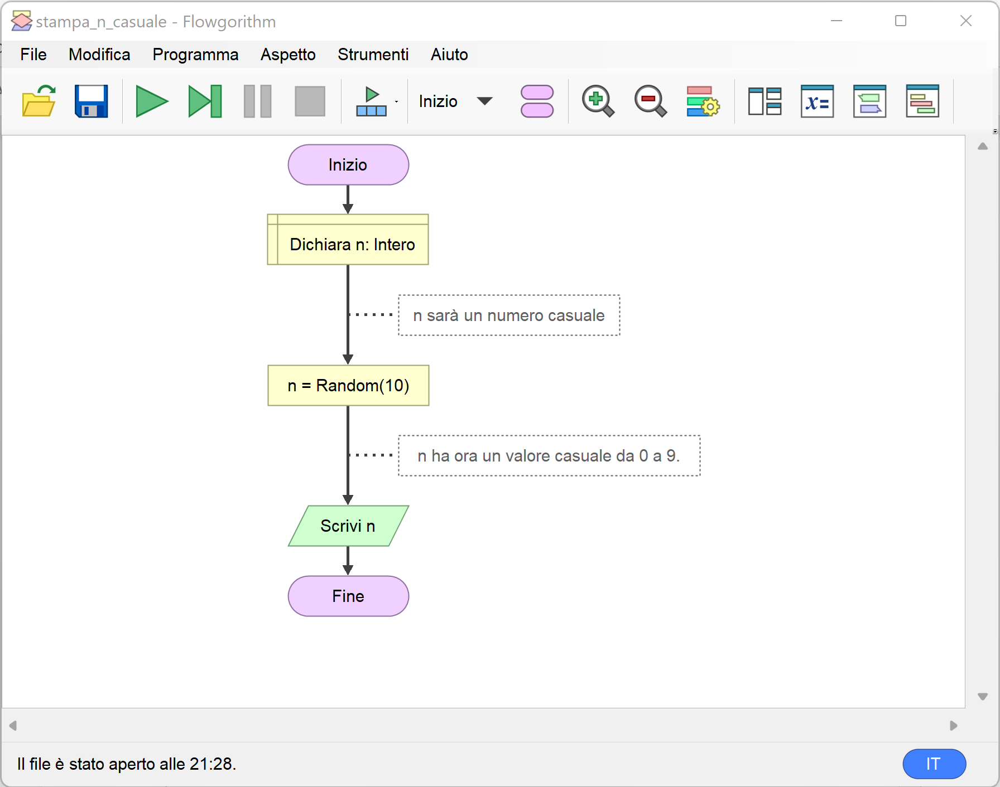

# Esempi con Flowgorithm e python

Ecco alcuni esempi di semplici algoritmi e programmi con _Flowgorithm_ e loro equivalenti in _python_.

1. TOC
{: toc }

## Somma di due numeri

Chiede all'utente due numeri e stampa la loro somma.



Codice equivalente in _python_:

```python
x = int(input())
y = int(input())
print(x + y)
```

## Quale di due numeri è il maggiore?

Chiede all'utente due numeri e indica quale è il maggiore.



Codice equivalente in _python_:

```python
x = int(input())
y = int(input())
if x > y:
  print("x è maggiore")
else:
  print("y è maggiore o uguale")
```

## Ripeti finché non si inserisce zero

Chiedi a ripetizione un numero all'utente fino a quando questo non inserisce zero.


Codice equivalente in _python_:

```python
x = int(input())
while x != 0:
  print("x è diverso da zero, inserisci un nuovo numero")
  x = int(input())
```

## Stampa un numero casuale tra 0 e 9

Ogni volta che il programma viene eseguito stampa un numero diverso.



Codice equivalente in _python_:

```python
from random import randint

n = randint(0, 9)
print(n)
```
